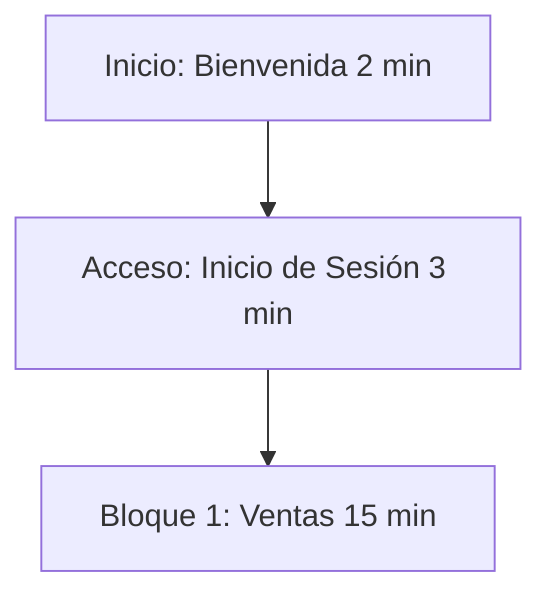
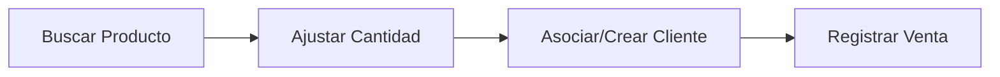
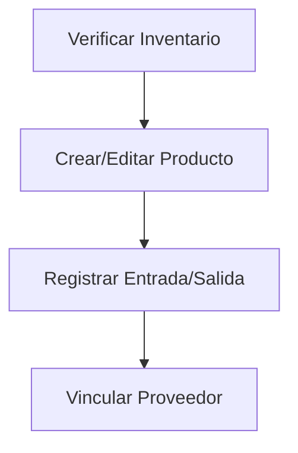
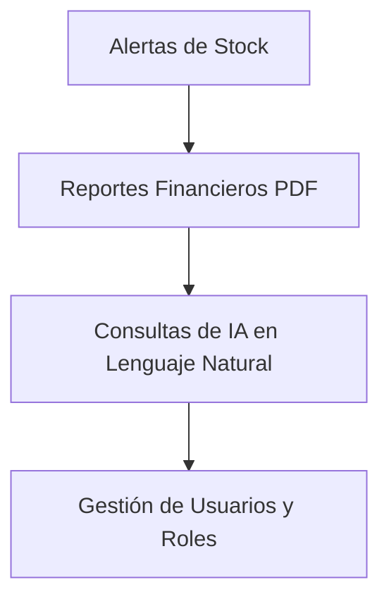

# 🎯 Guión y Plan de Capacitación - AcaciosWork
*Versión 1.1 — Guía Metodológica para la Capacitación de Usuarios Finales (45 Minutos)*

**Autor:** Rubiel Andrés Díaz  
**Contacto:** andresrubiel@gmail.com  
**Copyright © 2026 Rubiel Andrés Díaz**

---

## 📝 Introducción

En el dinámico entorno comercial actual, la adopción exitosa de tecnologías de gestión de inventarios y puntos de venta (POS) depende fundamentalmente de la preparación de los usuarios finales. El presente documento establece el **Guión y Plan de Capacitación** para **AcaciosWork**, estructurado minuciosamente para completarse en una sesión práctica e intensiva de **45 minutos**. 

Este plan proporciona al facilitador o instructor una guía metodológica y un libreto narrativo detallado, organizando los tiempos y temas según los diferentes roles del negocio (Cajeros, Encargados de Bodega y Administradores). El objetivo es familiarizar al personal con la interfaz gráfica mediante la inserción de imágenes del sistema en tiempo real, automatizar tareas cotidianas y mitigar el riesgo operativo mediante la manipulación directa de la plataforma.

---

## 🎯 Objetivos de la Capacitación

### Objetivo General
Capacitar al personal administrativo, operativo y de ventas en el uso ágil y correcto de la plataforma web **AcaciosWork** en una sesión guiada de 45 minutos, garantizando la comprensión de sus funciones clave según el rol de cada usuario.

### Objetivos Específicos
* **Cajeros / Vendedores:** Dominar el módulo de Punto de Venta (POS) para buscar productos, estructurar el carrito de compras, registrar clientes nuevos y completar transacciones en menos de 30 segundos.
* **Encargados de Bodega / Inventario:** Interpretar el semáforo visual de stock crítico, registrar movimientos de entrada/salida de mercancía de forma justificada y gestionar la base de datos de proveedores.
* **Administradores / Propietarios:** Interpretar los tableros de control financiero (Dashboard y Reportes), exportar resúmenes en formato PDF para contabilidad, y utilizar el asistente de Inteligencia Artificial para consultas rápidas en lenguaje natural.
* **Seguridad y Soporte:** Fomentar prácticas seguras como el manejo de credenciales personales y el cierre correcto de la sesión activa al finalizar la jornada.

---

## 📌 Ficha Técnica del Plan de Capacitación

* **Nombre del Taller:** Implementación Eficiente y Operación de AcaciosWork
* **Duración Total:** 45 Minutos
* **Audiencia Objetivo:** Cajeros (Operadores POS), Encargados de Inventario/Bodega, y Administradores/Propietarios del Negocio.
* **Metodología:** Demostración en vivo (60%) + Práctica guiada en tiempo real (30%) + Preguntas y respuestas (10%).
* **Materiales Requeridos:**
  * Computador para el instructor conectado a proyector o pantalla compartida.
  * Computadores/dispositivos de práctica para los usuarios (con acceso a internet y navegador web).
  * Credenciales de acceso de prueba previamente creadas para cada rol.
  * Copia digital o física del [Manual de Usuario](file:///C:/copia%20de%20proyecto%20Acacios%20Work/AcaciosWork/Manual%20de%20usuario/MANUAL_USUARIO.md).

---

## ⏰ Cronograma General (45 Minutos)

| Bloque | Duración | Módulo / Tema | Roles Involucrados |
| :--- | :---: | :--- | :--- |
| **1. Introducción** | 05 min | Bienvenida, objetivos y acceso inicial | Todos los Roles |
| **2. Ventas (POS)** | 15 min | Operación del Punto de Venta y Clientes | Cajeros, Administradores |
| **3. Inventario** | 12 min | Gestión de stock, movimientos y proveedores | Encargados de Bodega, Admins |
| **4. Administración** | 08 min | Reportes, IA, Alertas, Usuarios y Ajustes | Administradores, Propietarios |
| **5. Cierre y Q&A** | 05 min | Preguntas frecuentes, soporte y cierre seguro | Todos los Roles |

---

## 🗣️ Libreto Detallado Paso a Paso

### 1. Bloque de Introducción (00:00 - 00:05)
* **Objetivo:** Captar el interés, validar el acceso del personal y contextualizar la herramienta.

#### ⏱️ Minuto 00:00 - 00:02 | Bienvenida y Agenda
* **Rol Objetivo:** Todos los roles.
* **Diálogo del Facilitador:**
  > *"¡Hola a todos! Bienvenidos a la sesión de capacitación de **AcaciosWork**, el nuevo sistema de ventas e inventario inteligente que optimizará nuestras operaciones diarias. Hoy aprenderemos a registrar ventas rápidamente, controlar existencias sin esfuerzo y tomar decisiones de negocio inteligentes. Todo esto en 45 minutos. Empezaremos con el acceso básico y luego nos dividiremos en las funciones específicas de sus roles."*
* **Acción en Pantalla:** Mostrar la pantalla de inicio de sesión de AcaciosWork.
* **Interacción del Usuario:** Ubicar sus computadoras de práctica y abrir el enlace del sistema.

#### ⏱️ Minuto 00:02 - 00:05 | Acceso al Sistema y Dashboard
* **Rol Objetivo:** Todos los roles.
* **Diálogo del Facilitador:**
  > *"Cada uno tiene una tarjeta con su usuario y contraseña temporal. Vamos a ingresar. En la pantalla verán la interfaz de **Acceso al sistema** (como se muestra abajo). Escriban su usuario, su contraseña con cuidado de las mayúsculas, y hagan clic en el botón naranja **Iniciar Sesión**. Al entrar, aterrizarán directamente en el **Dashboard** o Panel de Control."*

* **Diálogo del Facilitador (Continuación):**
  > *"Una vez dentro, observen la pantalla del **Dashboard** (como la que se proyecta abajo). Aquí tenemos las tarjetas de resumen: 'Total Productos', 'Stock Bajo' (productos críticos) y 'Próximos a Vencer'. Al lado izquierdo está nuestro menú lateral de navegación. En el centro, la tabla muestra barras de progreso de colores: el rojo y naranja nos advierten que el stock está bajo y hay que reabastecer, mientras que el verde significa que estamos en niveles óptimos."*

* **Acción en Pantalla:** 
  1. Digitar credenciales de prueba en el formulario y hacer clic en **Iniciar Sesión**.
  2. Señalar las tarjetas superiores y las barras de progreso de colores en el Dashboard.
* **Interacción del Usuario:** Ingresar al sistema con sus credenciales de prueba y explorar visualmente el Dashboard.

---

### 2. Bloque de Ventas y POS (00:05 - 00:20)
* **Objetivo:** Capacitar al personal de caja para facturar en menos de 30 segundos y afiliar clientes en caliente.

#### ⏱️ Minuto 00:05 - 00:10 | Búsqueda y Selección de Productos
* **Rol Objetivo:** Cajeros y Administradores.
* **Diálogo del Facilitador:**
  > *"Vamos a posicionarnos en el módulo **Vender** en el menú de la izquierda. Esta es nuestra interfaz de Punto de Venta (POS) vacía. Para agregar un producto, hacemos clic en el buscador superior. Si tenemos lector de código de barras, lo pasamos sobre el artículo; si no, escribimos las primeras letras del nombre. Observen el autocompletado en pantalla: se despliega una lista dinámica mostrando el stock actual y el precio. Hacemos clic sobre el artículo deseado para agregarlo al carrito."*

* **Acción en Pantalla:**
  1. Hacer clic en **Vender** en el menú lateral.
  2. Escribir *"Arroz"* (u otro producto de prueba) y seleccionarlo de la lista dinámica.
  3. Agregar 2 o 3 productos adicionales al carrito.
* **Interacción del Usuario:** Realizar la búsqueda y agregar al menos dos productos al carrito en sus pantallas de práctica.

#### ⏱️ Minuto 00:10 - 00:13 | Modificación de Cantidades en el Carrito
* **Rol Objetivo:** Cajeros y Administradores.
* **Diálogo del Facilitador:**
  > *"Una vez que los productos están en la lista del carrito, podemos cambiar la cantidad que el cliente llevará escribiendo directamente en la casilla **CANT.** de cada fila. El total se actualizará de inmediato. Si nos equivocamos de producto, simplemente hacemos clic en la **X roja** al final de la fila para retirarlo del carrito."*
* **Acción en Pantalla:**
  1. Modificar el campo **CANT.** de `1` a `5` en un producto del carrito.
  2. Hacer clic en la **X** de otro producto para eliminarlo y ver cómo se recalcula el total.
* **Interacción del Usuario:** Ajustar cantidades y eliminar un producto del carrito.

#### ⏱️ Minuto 00:13 - 00:17 | Asociación de Cliente y Registro de la Venta
* **Rol Objetivo:** Cajeros y Administradores.
* **Diálogo del Facilitador:**
  > *"En el panel derecho llamado 'Resumen de Venta', seleccionamos el cliente. Si es frecuente, lo buscamos en la lista desplegable. Si no está registrado, hacemos clic en el botón verde **+ Nuevo Cliente**. Esto abrirá la ventana emergente de registro (que vemos abajo). Llenamos los datos básicos del cliente (Nombre, Documento, Teléfono), guardamos, y quedará asociado automáticamente. Finalmente, revisamos el total y hacemos clic en el botón verde **Registrar Venta**. El stock se actualizará al instante."*

* **Acción en Pantalla:**
  1. Mostrar la lista desplegable de clientes.
  2. Hacer clic en **+ Nuevo Cliente**, rellenar datos ficticios en el formulario y guardar.
  3. Hacer clic en **Registrar Venta** y mostrar el mensaje de éxito de la transacción.
* **Interacción del Usuario:** Registrar una venta completa asociando un cliente nuevo en sus terminales.

#### ⏱️ Minuto 00:17 - 00:20 | Práctica Guiada de Caja y Dudas Rápidas
* **Rol Objetivo:** Cajeros.
* **Diálogo del Facilitador:**
  > *"Tienen 3 minutos para registrar una venta completa de forma autónoma. Busquen un cliente existente o creen uno nuevo y finalicen la transacción. Si tienen problemas, levanten la mano."*
* **Interacción del Usuario:** Registrar una venta simulada de forma individual.
* **Tip del Facilitador:** Monitorear que los cajeros no intenten vender productos con stock `0` (el sistema les alertará si el inventario es insuficiente).

---

### 3. Bloque de Gestión de Inventario (00:20 - 00:32)
* **Objetivo:** Capacitar a los encargados de bodega en el registro de productos, control de mermas y entradas de proveedores.

#### ⏱️ Minuto 00:20 - 00:23 | Lectura del Inventario (Semáforo de Stock)
* **Rol Objetivo:** Encargados de Bodega y Administradores.
* **Diálogo del Facilitador:**
  > *"Pasemos ahora a **Inventario**. Como encargados de bodega, este es nuestro centro de mando. Presten atención a la tabla general de inventario (que vemos abajo). Aquí visualizaremos el stock actual de cada artículo. El número de la columna **STOCK** cambia de color automáticamente en base al stock mínimo: Rojo/Naranja para reabastecimiento urgente, y Verde para existencias seguras."*

* **Acción en Pantalla:**
  1. Navegar a **Inventario** en el menú.
  2. Filtrar por un producto con stock crítico para mostrar la barra roja/naranja.
  3. Filtrar por un producto óptimo para mostrar la barra verde.
* **Interacción del Usuario:** Navegar a la sección de inventario y buscar un producto con bajo stock usando el filtro de búsqueda.

#### ⏱️ Minuto 00:23 - 00:27 | Registro de Nuevo Producto e Proveedores
* **Rol Objetivo:** Encargados de Bodega y Administradores.
* **Diálogo del Facilitador:**
  > *"Cuando llegue un producto nuevo que no tengamos en catálogo, hacemos clic en el botón verde **+ Nuevo Producto**. Completamos los campos del formulario (que vemos abajo): código de barras, nombre, stock inicial, stock mínimo (nuestro límite de alerta) y óptimo, precios de compra y venta, e IVA. Al final, seleccionamos la categoría y el proveedor (los cuales administramos en la sección de **Proveedores**, como se muestra a la derecha). Guardamos y el producto estará disponible de inmediato."*

* **Acción en Pantalla:**
  1. Hacer clic en **+ Nuevo Producto**.
  2. Llenar el formulario con datos de ejemplo (Ej: *"Leche Entera 1L"*, código de barras, stock mínimo 10, precio de compra $1500, precio de venta $2200).
  3. Hacer clic en **Guardar**.
* **Interacción del Usuario:** Observar el flujo y, de forma opcional, abrir el formulario para familiarizarse con los campos obligatorios.

#### ⏱️ Minuto 00:27 - 00:30 | Entradas y Salidas de Existencias
* **Rol Objetivo:** Encargados de Bodega y Administradores.
* **Diálogo del Facilitador:**
  > *"Nunca modifiquen el stock editando el producto directamente. Para auditoría, usem los botones rápidos **Entrada** y **Salida**. Si llega un pedido del proveedor, hacemos clic en **Entrada**, digitamos la cantidad y el número de factura. Si se vence un producto o se daña, hacemos clic en **Salida**, ponemos la cantidad a retirar y justificamos el motivo, por ejemplo: 'Empaque roto' o 'Vencido'. Esto mantiene la contabilidad y el historial limpios."*

* **Acción en Pantalla:**
  1. Ubicar un producto de prueba y hacer clic en **Entrada**. Llenar `20` unidades con referencia *"Factura 995"*. Guardar.
  2. Hacer clic en **Salida** en otro producto. Llenar `2` unidades y en motivo colocar *"Vencido"*. Guardar.
* **Interacción del Usuario:** Realizar un ajuste de Entrada de 10 unidades en cualquier producto en su panel de práctica.

#### ⏱️ Minuto 00:30 - 00:32 | Proveedores y Vinculación
* **Rol Objetivo:** Encargados de Bodega y Administradores.
* **Diálogo del Facilitador:**
  > *"En el módulo **Proveedores** podemos guardar los contactos de quienes nos surten el negocio. Al crear un nuevo proveedor con el botón verde **+ Nuevo Proveedor**, recuerden llenar la cuenta bancaria para agilizar los pagos de administración."*
* **Acción en Pantalla:** Mostrar la pantalla de **Proveedores** y abrir el modal **+ Nuevo Proveedor** para repasar los campos de contacto y cuenta bancaria.

---

### 4. Bloque de Administración y Herramientas Inteligentes (00:32 - 00:40)
* **Objetivo:** Capacitar al administrador y dueño del negocio en la interpretación de reportes financieros, alertas consolidadas, gestión de personal e IA.

#### ⏱️ Minuto 00:32 - 00:34 | Monitoreo de Alertas Consolidadas
* **Rol Objetivo:** Administradores y Propietarios.
* **Diálogo del Facilitador:**
  > *"Como administradores, queremos saber qué falta comprar de un solo vistazo. Si el botón **Alertas** del menú izquierdo tiene un número en rojo, hacemos clic en él. Veremos agrupados todos los productos del negocio que requieren reabastecimiento urgente (como vemos abajo)."*

* **Acción en Pantalla:** Hacer clic en **Alertas** y mostrar la lista consolidada de productos con inventario bajo el mínimo.

#### ⏱️ Minuto 00:34 - 00:36 | Reportes Financieros y Descarga PDF
* **Rol Objetivo:** Administradores y Propietarios.
* **Diálogo del Facilitador:**
  > *"En el módulo **Reportes** visualizaremos el pulso de la empresa. Veremos gráficos interactivos de ventas, nuestras ganancias netas y los artículos estrella. Lo mejor de todo es que podemos filtrar por rangos de fecha y exportar esta información a un documento PDF con un solo clic para enviarlo a contabilidad."*

* **Acción en Pantalla:**
  1. Navegar a **Reportes**.
  2. Mostrar los gráficos interactivos.
  3. Hacer clic en **Descargar PDF** y abrir brevemente el reporte estructurado de muestra.

#### ⏱️ Minuto 00:36 - 00:38 | Consultas Inteligentes con Inteligencia Artificial (IA)
* **Rol Objetivo:** Administradores y Propietarios.
* **Diálogo del Facilitador:**
  > *"¿No tienen tiempo de buscar en las tablas? AcaciosWork incluye un asistente de Inteligencia Artificial. Hacemos clic en **Preguntas Inteligentes**, escribimos lo que necesitamos saber en lenguaje cotidiano, como por ejemplo: ¿Cuál fue nuestro producto estrella este mes? o ¿Cuál es el valor total de nuestro inventario? y la IA analizará los datos dándonos la respuesta al instante."*

* **Acción en Pantalla:**
  1. Ir a **Preguntas Inteligentes**.
  2. Escribir en el chat: *¿Qué productos tienen stock crítico y requieren compra?*
  3. Enviar la pregunta y mostrar la respuesta de la IA.
* **Interacción del Usuario:** Observar con atención el potencial analítico del chat.

> [!TIP]
> Use la IA para auditorías rápidas del inventario al final de la jornada laboral sin tener que exportar hojas de cálculo.

#### ⏱️ Minuto 00:38 - 00:40 | Gestión de Usuarios y Accesos
* **Rol Objetivo:** Administradores.
* **Diálogo del Facilitador:**
  > *"Por último, la seguridad. En **Usuarios** registramos a nuestro personal. Podemos crear cuentas para cajeros o bodegueros, asignarles sus respectivos roles, y si un empleado deja de laborar, simplemente cambiamos su estado a **Inactivo** para restringir su acceso de inmediato."*

* **Acción en Pantalla:**
  1. Ir al módulo **Usuarios**.
  2. Hacer clic en **Editar** en un usuario de prueba.
  3. Mostrar cómo se cambia el rol (Cajero, Administrador) y el estado (Activo/Inactivo).

---

### 5. Bloque de Cierre y Preguntas (00:40 - 00:45)
* **Objetivo:** Resolver dudas generales, evaluar la sesión y asegurar las mejores prácticas de cierre de sesión.

#### ⏱️ Minuto 00:40 - 00:43 | Dudas y Preguntas Frecuentes
* **Rol Objetivo:** Todos los roles.
* **Diálogo del Facilitador:**
  > *"Abrimos el espacio para resolver dudas. ¿Tienen alguna pregunta sobre el registro de ventas, el ingreso de mercancía o la descarga de reportes financieros?"*
* **Preguntas Clave Frecuentes a Responder:**
  * *¿Qué pasa si vendo un producto sin existencias?* (El sistema avisa y previene la venta en negativo según los ajustes).
  * *¿La IA puede modificar mis precios de venta?* (No, la IA es netamente consultiva; las modificaciones se hacen en el módulo de Inventario).

#### ⏱️ Minuto 00:43 - 00:45 | Cierre Seguro de Sesión y Recursos
* **Rol Objetivo:** Todos los roles.
* **Diálogo del Facilitador:**
  > *"Para terminar la jornada de manera segura y proteger los datos comerciales, nunca dejen la pestaña del sistema abierta. Vayan a la parte inferior del menú izquierdo y hagan clic en el botón naranja **Cerrar sesión** (como se muestra abajo). Esto los llevará de vuelta a la pantalla de inicio segura. En sus correos tienen el enlace al [Manual de Usuario](file:///C:/copia%20de%20proyecto%20Acacios%20Work/AcaciosWork/Manual%20de%20usuario/MANUAL_USUARIO.md) para consultas futuras. ¡Muchas gracias por su participación!"*

* **Acción en Pantalla:** Hacer clic en **Cerrar sesión** en la cuenta de demostración del instructor para volver al login.
* **Interacción del Usuario:** Realizar el cierre de sesión en sus computadoras de práctica.

---

## 📈 Plan de Evaluación Post-Capacitación

Para garantizar que la capacitación de 45 minutos fue efectiva, el administrador o instructor puede realizar la siguiente validación práctica a los usuarios (Toma 5 minutos individuales al día siguiente):

1. **Prueba para Cajeros:** Pedirle al cajero que registre una venta de 3 productos diferentes, afilie a un cliente ficticio nuevo en el proceso, y complete la facturación.
2. **Prueba para Bodegueros:** Solicitar al encargado registrar una entrada de stock de 50 unidades de un producto con referencia de factura y una salida de 3 unidades justificando merma por daño.
3. **Prueba para Administradores:** Solicitarle que realice una consulta a la Inteligencia Artificial sobre las ventas de la semana y que descargue el reporte financiero consolidado del mes en formato PDF.

---

## 🏁 Conclusiones del Plan de Capacitación

* **Curva de Aprendizaje Optimizada:** La división temática y por roles dentro del plan de 45 minutos evita la sobrecarga cognitiva en los usuarios. Cada operario se enfoca exclusivamente en sus herramientas de trabajo del día a día, logrando una asimilación rápida del flujo de trabajo.
* **Reducción del Riesgo Operativo:** Al formalizar los procesos de entradas y salidas (en lugar de la edición manual directa de stock), el negocio asegura la trazabilidad de la mercancía. Esto previene pérdidas, mermas inexplicables y mantiene al día las alertas de inventario.
* **Empoderamiento Administrativo con IA:** Capacitar al propietario en el uso del módulo de "Preguntas Inteligentes" con Inteligencia Artificial reduce la brecha técnica. El usuario puede realizar análisis complejos de ventas y stock en lenguaje natural y tomar decisiones inmediatas sin depender de analistas externos.
* **Trazabilidad y Evaluación Continuas:** El plan de evaluación posterior garantiza que la capacitación no sea un evento aislado, sino un proceso medible. Esto permite identificar cuellos de botella en la operación y brindar refuerzos oportunos a los empleados que lo requieran.

---
*Fin del libreto. AcaciosWork - Gestión inteligente de su comercio.*
