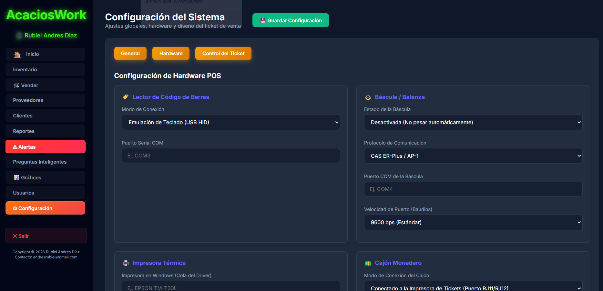

# 📖 Manual de Usuario - AcaciosWork (Administrador)
*Versión 1.0 — Gestión de Inventario y Ventas Inteligente*

**Autor:** Rubiel Andrés Díaz  
**Contacto:** andresrubiel@gmail.com  
*Copyright © 2026 Rubiel Andrés Díaz*

¡Bienvenido al **Manual de Usuario de AcaciosWork**! Este documento está diseñado para ayudarte a entender y operar todas las herramientas de la plataforma web de administración, explicadas paso a paso y sin términos técnicos complicados.

---

## 📌 Tabla de Contenido
- [📝 Introducción](#-introducción)
- [🎯 Objetivos](#-objetivos)
- [💻 Requisitos del Sistema](#-requisitos-del-sistema)
1. [🔑 Acceso al Sistema (Inicio de Sesión)](#1-acceso-al-sistema-inicio-de-sesión)
2. [📊 El Panel de Control (Dashboard)](#2-el-panel-de-control-dashboard)
3. [💳 Módulo de Ventas (Punto de Venta - POS)](#3-módulo-de-ventas-punto-de-venta-pos)
4. [📦 Gestión de Inventario y Productos](#4-gestión-de-inventario-y-productos)
   - [Ver Inventario](#ver-inventario)
   - [Agregar un Nuevo Producto](#agregar-un-nuevo-producto)
   - [Modificar o Editar un Producto](#modificar-o-editar-un-producto)
   - [Control de Entradas y Salidas de Mercancía](#control-de-entradas-y-salidas-de-mercancía)
   - [Eliminar un Producto](#eliminar-un-producto)
5. [🤝 Gestión de Proveedores](#5-gestión-de-proveedores)
   - [Ver y Buscar Proveedores](#ver-y-buscar-proveedores)
   - [Agregar un Nuevo Proveedor](#agregar-un-nuevo-proveedor)
   - [Editar o Eliminar Proveedores](#editar-o-eliminar-proveedores)
6. [👥 Gestión de Clientes](#6-gestión-de-clientes)
   - [Ver y Buscar Clientes](#ver-y-buscar-clientes)
   - [Agregar un Nuevo Cliente](#agregar-un-nuevo-cliente)
   - [Editar o Eliminar Clientes](#editar-o-eliminar-clientes)
7. [📈 Módulos Adicionales (Reportes, Alertas, IA, Usuarios, Configuración y Cerrar Sesión)](#7-módulos-adicionales-reportes-alertas-ia-usuarios-configuración-y-cerrar-sesión)
   - [Módulo de Reportes y Estadísticas](#módulo-de-reportes-y-estadísticas)
   - [Notificaciones de Alertas](#notificaciones-de-alertas)
   - [Preguntas Inteligentes (Inteligencia Artificial)](#preguntas-inteligentes-inteligencia-artificial)
   - [Gestión de Usuarios](#gestión-de-usuarios)
   - [Configuración](#configuración)
   - [Cerrar Sesión](#cerrar-sesión)
- [🏁 Conclusiones](#-conclusiones)
- [📚 Referencias](#-referencias)

---

## 📝 Introducción
En el dinámico entorno comercial actual, la administración ágil y precisa de inventarios y transacciones comerciales es fundamental para el éxito y la sostenibilidad de cualquier negocio. **AcaciosWork** ha sido desarrollado como una solución integral que simplifica estas tareas, ofreciendo a los administradores una plataforma robusta, moderna e intuitiva. Este manual tiene como finalidad servir de guía detallada para comprender, configurar y operar eficientemente todas las funcionalidades de la plataforma.

---

## 🎯 Objetivos
### Objetivo general
Explicar el funcionamiento detallado del sistema de información **AcaciosWork** para facilitar a los usuarios la gestión diaria de sus operaciones de venta, control de inventario y administración de personal.

### Objetivos específicos
* Guiar de forma secuencial en el proceso de inicio de sesión y uso del panel de control principal.
* Detallar los pasos para registrar ventas ágilmente mediante el módulo de punto de venta (POS).
* Explicar el manejo integral de productos, entradas, salidas y catalogación de existencias.
* Describir la administración de clientes y proveedores registrados en la base de datos.
* Orientar al usuario en el uso de herramientas inteligentes de análisis financiero (reportes), alertas de stock mínimo, gestión de accesos.

---

## 💻 Requisitos del Sistema
Para asegurar un rendimiento estable y sin interrupciones del software, es importante cumplir con las siguientes especificaciones técnicas:

### Hardware
* **Procesador**: Intel Core i3 (de 5.ª generación en adelante) o procesador con rendimiento equivalente.
* **Memoria RAM**: Mínimo 4 GB (se recomiendan 8 GB para un desempeño óptimo y fluido en multitarea).
* **Almacenamiento**: Al menos 500 MB de espacio libre en disco para datos locales y almacenamiento en caché del navegador.
* **Pantalla**: Resolución gráfica mínima de 1280x720 píxeles.

### Software
* **Sistema Operativo**: Windows 10 o superior (compatible también con macOS Mojave o superior, y distribuciones modernas de GNU/Linux).
* **Navegador Web**: Google Chrome (versión 90 o superior recomendada), Mozilla Firefox, Microsoft Edge o Apple Safari.
* **Entorno de Ejecución**: Java JRE/JDK 17 o superior instalado (si aplica para la ejecución del servidor local en el backend).
* **Conexión a Internet**: Conexión activa y estable a red para el procesamiento de consultas y almacenamiento de datos en la nube.

---

## 1. 🔑 Acceso al Sistema (Inicio de Sesión)

Para ingresar a la plataforma, debes abrir el sistema en tu navegador web. Encontrará una pantalla limpia y segura de inicio de sesión.

**Pasos para ingresar:**
1. En el campo **Usuario**, ingresa tu nombre de usuario asignado.
2. En el campo **Contraseña**, escribe tu clave de seguridad (se mostrará con puntos por seguridad).
3. Haz clic en el botón naranja **Iniciar Sesión**.

*Figura 1: Formulario de ingreso seguro al sistema administrativo.*

---

## 2. 📊 El Panel de Control (Dashboard)

Una vez ingresas al sistema, verás la pantalla de **Inicio** o **Dashboard**. Esta sección te da un resumen automático del estado de tu negocio.

*Figura 2: Vista general del estado de inventarios, valores y alertas del negocio.*

En esta pantalla encontrarás:
* **Menú Lateral Izquierdo**: Te permite navegar a cualquier sección del sistema (Vender, Inventario, Clientes, etc.). Siempre verás tu nombre y rol en la parte superior del menú.
* **Tarjetas de Resumen**:
  * **Total Productos**: La cantidad de artículos distintos registrados en tu catálogo.
  * **Próximos a Vencer**: Alertas de productos cuya fecha de caducidad está cerca.
  * **Stock Bajo**: Cuántos productos están por debajo del límite mínimo permitido.
  * **Valor Inventario / Valor Costo**: El valor total de tus productos a precio de venta y de compra, respectivamente.
  * **Ganancia**: El margen neto estimado de ganancia con el inventario actual.
* **Tabla de Resumen de Inventario**: Muestra una lista rápida de tus productos con una **barra de progreso de colores** que te indica visualmente qué tan lleno está tu stock:
  * **Rojo/Naranja**: Stock en nivel crítico (necesitas reabastecer).
  * **Verde**: Stock en nivel óptimo y seguro.
* **Barra de Búsqueda**: Puedes escribir el nombre de cualquier producto en la casilla "Buscar en la tabla..." para filtrarlo al instante.

---

## 3. 💳 Módulo de Ventas (Punto de Venta - POS)

El módulo **Vender** es donde registras las compras de tus clientes de manera rápida y sencilla.

*Figura 3: Interfaz principal para el registro de ventas.*

### ¿Cómo registrar una venta paso a paso?

1. **Buscar y Agregar Productos**:
   Haz clic en la barra **BUSCAR PRODUCTO** y escribe las primeras letras del nombre del producto o su código de barras. Se desplegará una lista de sugerencias donde verás el stock actual y el precio de cada uno. Haz clic sobre el producto deseado para agregarlo al carrito.
   
   
   
   *Figura 4: Búsqueda dinámica de productos e integración en la orden de venta.*

2. **Ajustar Cantidades**:
   Una vez agregados los productos a la lista, puedes cambiar la cantidad de unidades que el cliente va a llevar escribiendo directamente en la casilla **CANT.** de cada fila. Si te equivocas, puedes eliminar un artículo haciendo clic en la **X roja** al final de la fila.

3. **Asociar un Cliente**:
   En el panel derecho **Resumen de Venta**, selecciona el nombre del cliente en la lista desplegable. Si el cliente no está registrado, puedes crear uno nuevo inmediatamente haciendo clic en el botón verde **+ Nuevo Cliente**.

4. **Confirmar y Registrar la Venta**:
   * Revisa que el **Total** y los subtotales sean correctos.
   * Haz clic en el botón verde **Registrar Venta** para guardar la transacción y restar los productos del inventario.
   * Si deseas cancelar todo el proceso y vaciar la lista de compras, haz clic en el botón **Limpiar carrito**.

---

## 4. 📦 Gestión de Inventario y Productos

El módulo de **Inventario** te permite mantener un control estricto de los productos que tienes a la venta, sus precios de compra/venta, impuestos (IVA) y fechas de vencimiento.

### Ver Inventario
En esta pantalla verás una lista detallada de todo tu catálogo. El número del **STOCK** cambia de color automáticamente (Rojo, Naranja o Verde) para alertarte sobre los niveles de inventario de cada artículo.

*Figura 5: Vista de administración total de existencias y precios.*

---

### Agregar un Nuevo Producto
Para registrar un producto que nunca antes has vendido:
1. Haz clic en el botón verde **+ Nuevo Producto** en la parte superior de la pantalla de inventario.
2. Completa el formulario con los siguientes datos:
   * **Código de Barras**: Código único del producto (para lector de barras o manual).
   * **Nombre del Producto**: Nombre comercial claro.
   * **Unidad de Medida**: Cómo se vende (Ej: unidad, x kilo, x libra, litros).
   * **Stock Actual**: Cantidad que tienes físicamente ahora mismo.
   * **Stock Mínimo**: El límite de seguridad (el sistema te avisará cuando te queden estas unidades).
   * **Stock Óptimo**: La cantidad ideal de este producto que deberías tener en bodega.
   * **Precio Compra y Precio Venta**: Precios unitarios de adquisición y venta al público.
   * **Fecha de Vencimiento**: Opcional, haz clic en el icono de calendario si el producto caduca.
   * **Categoría y Proveedor**: Selecciónalos de las listas desplegables.
   * **IVA (%)**: Impuesto aplicable (normalmente viene predeterminado en 19).
   * **Estado**: Déjalo en **Activo** para que se pueda vender.
3. Haz clic en **Guardar** (o *Cancelar* si no deseas crearlo).

*Figura 6: Ventana de registro para la creación de nuevos artículos.*

---

### Modificar o Editar un Producto
Si necesitas cambiar el precio, el stock mínimo, el nombre o cualquier dato de un producto:
1. Busca el producto en la tabla de inventario.
2. Haz clic en el botón **Editar** que se encuentra en la columna de acciones.
3. Modifica los campos que necesites en el formulario y haz clic en **Guardar**.

*Figura 7: Formulario de edición con datos cargados del producto.*

---

### Control de Entradas y Salidas de Mercancía
En lugar de editar el producto para cambiar el inventario a mano, el sistema te permite registrar movimientos de entrada (por compras o devoluciones) o salida (por pérdidas, mermas o autoconsumo).

* **Registrar Entrada (Ingresar Stock)**:
  1. Haz clic en el botón verde **Entrada** al lado del producto.
  2. Escribe la cantidad de unidades que ingresan.
  3. De forma opcional, escribe una referencia (Ej: "Factura N° 123") y una observación.
  4. Haz clic en **Agregar Stock**.

  

  *Figura 8: Formulario de ajuste positivo (ingreso) de stock.*

* **Registrar Salida (Retirar Stock)**:
  1. Haz clic en el botón rojo **Salida** al lado del producto.
  2. Escribe la cantidad de unidades que vas a retirar.
  3. Opcionalmente, explica el motivo (Ej: "Producto dañado" o "Vencido").
  4. Haz clic en el botón rojo **Retirar Stock**.

  

  *Figura 9: Formulario de ajuste negativo (retiro) de stock.*

---

### Eliminar un Producto
Si dejas de vender un producto definitivamente, puedes darlo de baja en el sistema:
1. Haz clic en el botón **Borrar** (en color rojo) del producto correspondiente.
2. El navegador mostrará una pregunta de confirmación en la parte superior.
3. Haz clic en **Aceptar** para confirmar la eliminación permanente, o en **Cancelar** para abortar.

*Figura 10: Ventana de confirmación para eliminar un producto del catálogo.*

---

## 5. 🤝 Gestión de Proveedores

Este módulo te ayuda a administrar la lista de empresas o personas que surten tu negocio.

### Ver y Buscar Proveedores
Al ingresar a **Proveedores** en el menú izquierdo, verás la lista de contactos registrados con su nombre, teléfono, correo electrónico y ciudad. Puedes usar la barra de búsqueda en la parte superior para localizar rápidamente a un proveedor específico.

*Figura 11: Listado de proveedores registrados en la plataforma.*

---

### Agregar un Nuevo Proveedor
1. Haz clic en el botón verde **+ Nuevo Proveedor**.
2. Completa los campos solicitados: Nombre/Razón Social, Tipo de Documento, Número de Documento (NIT o Cédula), Teléfono, Correo, Dirección física, Cuenta Bancaria (para registrar los datos de pago) y el Estado.
3. Haz clic en **Guardar**.

*Figura 12: Formulario de registro para nuevos distribuidores y proveedores.*

---

### Editar o Eliminar Proveedores
* **Editar**: Haz clic en el botón **Editar** en la fila del proveedor, modifica sus datos en el formulario y pulsa **Guardar**.
  
  
  
  *Figura 13: Ventana de edición para modificar datos del proveedor.*

* **Eliminar**: Haz clic en **Borrar** (rojo) y confirma la acción en la ventana de confirmación del navegador haciendo clic en **Aceptar**.
  
  
  
  *Figura 14: Mensaje de alerta del navegador para confirmar la eliminación de un proveedor.*

---

## 6. 👥 Gestión de Clientes

En esta sección registras a los compradores para llevar un historial o identificarlos en el Punto de Venta.

### Ver y Buscar Clientes
Muestra la base de datos de clientes con su Nombre, Documento, Teléfono y Correo. Dispone de tarjetas de resumen que indican la cantidad total de clientes y cuántos de ellos están activos.

*Figura 15: Base de datos de clientes registrados en el sistema.*

---

### Agregar un Nuevo Cliente
1. Haz clic en **+ Nuevo Cliente**.
2. Rellena los datos básicos: Nombre, Documento, Teléfono, Correo, Dirección, si es un **Cliente Frecuente** (Sí/No) y su Estado (Activo/Inactivo).
3. Haz clic en **Guardar**.

*Figura 16: Formulario de registro para la afiliación de clientes.*

---

### Editar o Eliminar Clientes
* **Editar**: Haz clic en el botón **Editar**, realiza las modificaciones del cliente (por ejemplo, cambiar su dirección o pasarlo a inactivo) y presiona **Guardar**.
  
  
  
  *Figura 17: Ventana de edición para actualizar información de un cliente.*

* **Eliminar**: Haz clic en **Borrar** y selecciona **Aceptar** en la ventana emergente de confirmación.
  
  
  
  *Figura 18: Ventana de confirmación de eliminación de cliente.*

---

## 7. 📈 Módulos Adicionales (Reportes, Alertas, IA, Usuarios, Configuración y Cerrar Sesión)

A continuación, se describen los módulos avanzados que complementan la gestión del negocio.

### Módulo de Reportes y Estadísticas
Permite visualizar el rendimiento financiero del negocio a través de gráficos interactivos de ventas, ganancias mensuales y productos más vendidos. También permite exportar estos resúmenes en formato PDF para contabilidad.
* **Cómo usarlo**: Ingresa a **Reportes** en el menú. Selecciona el rango de fechas que deseas analizar y el sistema generará los gráficos y tablas automáticamente. Podrás imprimirlos o guardarlos en PDF con un solo clic.

*Figura 19: Gráficas estadísticas de ventas y ganancias del negocio.*

*Figura 20: Opción para la descarga y exportación de reportes de ventas.*

*Figura 21: Ejemplo de reporte financiero descargado en formato PDF.*

---

### Notificaciones de Alertas
El sistema monitorea constantemente tu inventario. Cuando un artículo alcanza o baja de su **Stock Mínimo**, el botón **Alertas** del menú lateral se iluminará en rojo y mostrará un contador.
* **Cómo usarlo**: Haz clic en el botón **Alertas** del menú para ver la lista de todos los productos que requieren tu atención inmediata para reabastecimiento.

*Figura 22: Módulo de alertas que destaca los productos próximos a agotarse.*

---

### Preguntas Inteligentes (Inteligencia Artificial)
AcaciosWork cuenta con un asistente inteligente integrado que responde tus preguntas sobre el negocio en lenguaje natural.
* **Cómo usarlo**:
  1. Haz clic en **Preguntas Inteligentes** en el menú lateral.
  2. Escribe una pregunta en la casilla de texto (Ej: *"¿Cuál fue el producto más vendido este mes?"* o *"¿Tengo stock bajo de arroz?"*).
  3. Envía la pregunta y el asistente analizará los datos de tu inventario y ventas para darte una respuesta detallada al instante.

*Figura 23: Panel del chat inteligente interactivo con inteligencia artificial.*

*Figura 24: Configuración de fechas para enfocar las consultas analíticas del asistente de IA.*

---

### Gestión de Usuarios
Este módulo permite administrar los accesos del personal al sistema, permitiendo la creación de nuevos perfiles de usuario y la asignación de roles.
* **Cómo usarlo**:
  1. Haz clic en **Usuarios** en el menú lateral para ver la lista de personal registrado.
  
  
  
  *Figura 25: Vista general para la administración de usuarios del sistema.*

  2. Para registrar un nuevo empleado, haz clic en el botón verde **+ Nuevo Usuario**. Completa los datos requeridos (Nombre, correo, contraseña, rol y estado) y presiona **Guardar**.
  
  
  
  *Figura 26: Formulario para la creación de nuevos usuarios y asignación de roles.*

---

### Configuración
En esta sección puedes cambiar los datos de la empresa (Nombre de la tienda, dirección, teléfono que aparecerá en los comprobantes de venta) y preferencias generales del sistema.

*Figura 27: Sección de configuraciones generales y datos comerciales del negocio.*

---

### Cerrar Sesión
Para salir del sistema de forma segura y proteger la información de tu negocio:
* **Cómo usarlo**: Haz clic en el botón **Cerrar sesión** que se encuentra en la parte inferior del menú lateral izquierdo. Esto finalizará tu sesión activa y te redirigirá a la pantalla de inicio seguro del sistema.

*Figura 28: Opción de salida segura en la parte inferior del menú lateral.*

---

## 🏁 Conclusiones
La implementación de **AcaciosWork** como herramienta principal de administración centraliza y automatiza los procesos críticos del comercio, otorgando los siguientes beneficios:
* **Optimización de Tiempos**: Agiliza la facturación y el cobro mediante un carrito de compras interactivo y búsquedas predictivas en tiempo real.
* **Reducción de Pérdidas**: Las alertas visuales de stock bajo y productos próximos a vencer permiten a los administradores tomar decisiones oportunas de reabastecimiento.
* **Decisiones Inteligentes**: Los reportes y estadísticas con exportación a PDF brindan un panorama claro sobre las ganancias y los artículos más demandados.
* **Interactividad y Soporte**: El módulo de Inteligencia Artificial (IA) facilita el acceso directo a la información del negocio sin necesidad de navegar por menús complejos o realizar reportes manuales.
* **Control del Personal**: La administración de perfiles y usuarios garantiza que la información sensible sea gestionada únicamente por personal autorizado.

---

## 📚 Referencias
* Apple. (s. f.). *Human Interface Guidelines (HIG)*. https://developer.apple.com/design/human-interface-guidelines/
* Departamento Nacional de Planeación. (s. f.). *Guía para la elaboración de manuales de usuario de los sistemas de información*. https://bit.ly/31aMsek
* DeepMind Antigravity. (s. f.). *Guías de Pair-Programming y Asistencia en Ingeniería de Software*. https://github.com/google-deepmind
* Google. (s. f.). *Gemini AI API Documentation*. https://ai.google.dev/
* Pressman, R. S., & Maxim, B. R. (2020). *Ingeniería del software: Un enfoque práctico* (9.ª ed.). McGraw-Hill.
* Servicio Nacional de Aprendizaje. (s. f.). *Zajuna*. https://zajuna.sena.edu.co/

---

Copyright © 2026 Rubiel Andrés Díaz  
Contacto: andresrubiel@gmail.com
