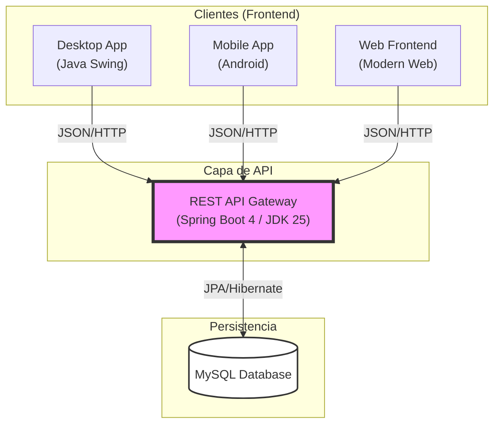
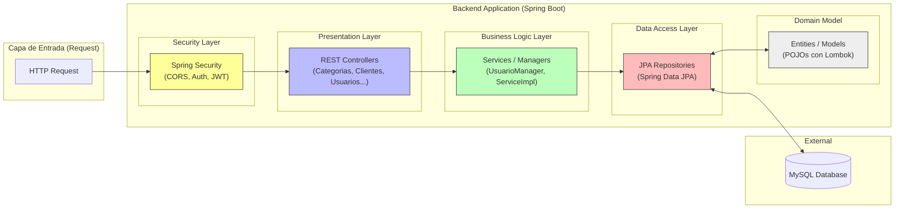

# Arquitectura del Proyecto AcaciosWork

Este documento presenta la arquitectura actual del ecosistema **AcaciosWork**, detallando la interacción entre los diferentes clientes y la estructura interna del backend.

## 1. Diagrama de Arquitectura de Sistema (Alto Nivel)

Este diagrama muestra cómo interactúan los diferentes módulos del proyecto. El núcleo es el **Backend (Spring Boot)**, que centraliza la lógica de negocio y la persistencia de datos para múltiples plataformas.

---

## 2. Diagrama de Arquitectura Interna del Backend

Este diagrama detalla la arquitectura de capas utilizada dentro del módulo `acacioswork-backend`, siguiendo las mejores prácticas de Spring Boot.

### Notas Clave de la Arquitectura:
*   **Multi-Cliente:** El backend está diseñado para servir a una aplicación de escritorio (Swing), móvil (Android) y web simultáneamente.
*   **Modernización:** Uso de **JDK 25** y **Spring Boot 4** para aprovechar las últimas optimizaciones del lenguaje.
*   **Estandarización:** Identificadores `BIGINT UNSIGNED` en base de datos mapeados como `Long` en Java para consistencia y escalabilidad.
*   **Seguridad:** Implementación de seguridad centralizada para manejar CORS y autenticación para diferentes orígenes.
