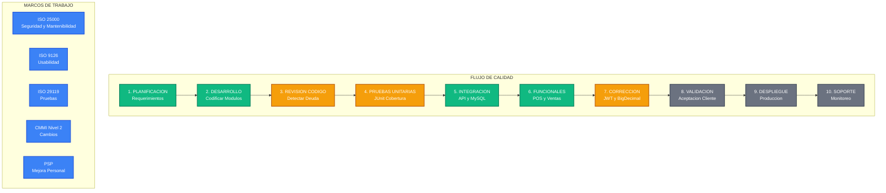

# GA11-220501098-AA1-EV03: Diseño y Diligenciamiento de Instrumentos para Documentar Procesos de Calidad del Software

**Aprendiz Sena:**  
Rubiel Andrés Díaz Jiménez.

**Programa:** Tecnólogo en Análisis y Desarrollo de Software  
**Centro de Formación:** Centro de Gestión y Desarrollo Sostenible Surcolombiano  
**Entidad:** Servicio Nacional de Aprendizaje (SENA)  
**Ficha:** 3118313  
**Instructor Líder:** Herley Antonio Puentes Peñaloza  
**Fecha:** 28 de Julio de 2026

---

## Tabla de Contenido
1. [Introducción](#introducción)
2. [Buenas prácticas seleccionadas](#buenas-prácticas-seleccionadas)
3. [Instrumento 1: Lista de Verificación de Calidad del Software](#instrumento-1-lista-de-verificación-de-calidad-del-software)
4. [Instrumento 2: Registro de Incidencias (Deuda Técnica Detectada)](#instrumento-2-registro-de-incidencias-deuda-técnica-detectada)
5. [Instrumento 3: Plan de Pruebas](#instrumento-3-plan-de-pruebas)
6. [Instrumento 4: Formato de Control de Cambios](#instrumento-4-formato-de-control-de-cambios)
7. [Instrumento 5: Evaluación de Calidad ISO/IEC 25000](#instrumento-5-evaluación-de-calidad-isoiec-25000)
8. [Instrumento 6: Criterios de Aceptación para Despliegue](#instrumento-6-criterios-de-aceptación-para-despliegue)
9. [Instrumento 7: Seguimiento del Proceso de Calidad](#instrumento-7-seguimiento-del-proceso-de-calidad)
10. [Infografía del Flujo de Calidad](#infografía-del-flujo-de-calidad)
11. [Conclusiones](#conclusiones)

---

Los instrumentos de calidad deben ser sencillos, fáciles de diligenciar y basados en buenas prácticas (ISO/IEC 25000, ISO/IEC 9126, ISO/IEC/IEEE 29119 y CMMI Nivel 2). A continuación se presentan los formatos diligenciados de acuerdo con la evaluación técnica real y el avance del proyecto **AcaciosWork**.

---

## INTRODUCCIÓN

La calidad del software constituye uno de los factores más importantes para garantizar que una aplicación responda adecuadamente a las necesidades del cliente y mantenga un funcionamiento seguro, eficiente y confiable.

En el desarrollo del sistema ERP/POS multiplataforma **AcaciosWork**, se implementan instrumentos de aseguramiento de la calidad alineados a estándares internacionales. Sin embargo, para que el aseguramiento de la calidad sea efectivo, los instrumentos deben reflejar de manera honesta la realidad técnica del proyecto, exponiendo la deuda técnica y las vulnerabilidades detectadas para poder gestionarlas y corregirlas formalmente.

Este documento presenta los instrumentos de calidad diligenciados al **31 de julio de 2026**, correspondientes a una madurez estimada del **70%** del sistema hacia su versión productiva.

---

## BUENAS PRÁCTICAS SELECCIONADAS

| Marco | Buena práctica aplicada en AcaciosWork |
| :--- | :--- |
| **ISO 25000** | Evaluación de adecuación funcional, eficiencia de rendimiento, seguridad y mantenibilidad. |
| **ISO 9126** | Evaluación del diseño de usabilidad, portabilidad y confiabilidad del software. |
| **ISO 29119** | Gestión y estructuración de pruebas de software unitarias e integrales. |
| **CMMI Nivel 2** | Gestión de configuración del proyecto, control de cambios y rastreabilidad de requerimientos. |
| **PSP** | Planeación y mejora continua del desarrollo personal. |

---

## INSTRUMENTO 1: LISTA DE VERIFICACIÓN DE CALIDAD DEL SOFTWARE

**Proyecto:** AcaciosWork  
**Versión de Evaluación:** 1.0 (Entorno de Desarrollo)  
**Fecha:** 31/07/2026

| Ítem | Verificación | Cumple | Observación / Evidencia Técnica |
| :--- | :---: | :---: | :--- |
| **Código documentado** | Sí | ✔ | JavaDoc implementado en Backend y comentarios en scripts Frontend. |
| **Convención camelCase** | Sí | ✔ | Respetada en clases Java y código JavaScript. |
| **Arquitectura multicapa** | Sí | ✔ | Backend centralizado y desacoplado de las apps Frontend, Desktop y Android. |
| **Autenticación JWT** | Sí | ✔ | Filtro `JwtAuthenticationFilter` conectado activamente en la cadena de seguridad de `SecurityConfig.java`. |
| **API REST funcional** | Sí | ✔ | 14 controladores y 20 servicios operativos y probados. |
| **Base de datos normalizada** | Sí | ✔ | Base de datos relacional MySQL normalizada. |
| **Control de versiones Git** | Sí | ✔ | Repositorio activo en GitHub con historial de commits estructurado. |
| **Pruebas unitarias** | Parcial | ⚠ | Estructura inicial con JUnit implementada, pero la cobertura de código es mínima (~4%). |
| **Seguridad por roles** | Sí | ✔ | Endpoints sensibles protegidos con `@PreAuthorize("hasRole('ADMIN')")` y roles validados por JWT. |
| **Manual técnico actualizado** | Sí | ✔ | Documentación detallada en archivos `.md` (`project-context.md`, `arquitectura_acacioswork.md`). |

### Resultado de Verificación
* **Cumplimiento Real:** **90%** (9 de 10 ítems aprobados).

---

## INSTRUMENTO 2: REGISTRO DE INCIDENCIAS (DEUDA TÉCNICA DETECTADA)

| ID | Fecha | Módulo | Descripción de la Incidencia | Prioridad | Estado |
| :--- | :---: | :--- | :--- | :---: | :---: |
| **INC-001** | 25/07/2026 | Seguridad Backend | Bypass de seguridad en `SecurityConfig.java` mediante `.anyRequest().permitAll()`. Todo endpoint de la API es público. | **Crítica** | **Corregida** |
| **INC-002** | 25/07/2026 | Reportes | `ReporteService.reporteGanancias()` no calcula ganancias reales (ganancia = venta - costo). Solo suma ventas brutas. | **Alta** | **Corregida** |
| **INC-003** | 25/07/2026 | Inventario | Alertas de stock crítico almacenadas en un `List` estático en memoria (`InventarioManager.java`); se pierden al reiniciar. | **Alta** | Abierta |
| **INC-004** | 25/07/2026 | Arquitectura Modelos | El modelo `Producto.java` usa tipo de dato `double` para los precios, lo que puede causar errores de redondeo financiero. | **Alta** | **Corregida** |
| **INC-005** | 25/07/2026 | Frontend Web | El archivo `dashboard.js` contiene 361 líneas (16 KB). Requiere continuar modularizando la lógica de reportes y DOM para mayor legibilidad. | Media | En Progreso |
| **INC-006** | 25/07/2026 | Base de Datos / API | Falta de validaciones `@Valid` en los controladores y carencia de paginación en peticiones masivas (`findAll`). | **Media** | Abierta |

---

## INSTRUMENTO 3: PLAN DE PRUEBAS

| Caso | Módulo | Tipo | Resultado esperado | Estado | Observación |
| :--- | :--- | :--- | :--- | :---: | :--- |
| **CP-001** | Seguridad | Unitaria | Acceso denegado a `/api/**` sin token JWT válido. | **Aprobado** | Filtro JWT activo; rechaza peticiones anónimas con código 401/403. |
| **CP-002** | Inventario | Integración | Decremento automático de stock al registrar venta. | **Aprobado** | La base de datos actualiza el stock correctamente. |
| **CP-003** | POS | Funcional | Registro completo de ticket y emisión de datos. | **Aprobado** | Flujo de caja inicial operativo de forma local. |
| **CP-004** | Reportes | Funcional | El reporte muestra ganancia real y genera el PDF. | **Aprobado** | Genera el PDF y calcula ganancias netas reales correctamente restando costos de compra. |
| **CP-005** | Clientes | Integración | Registro y lectura de clientes desde la App Android. | **Aprobado** | Endpoint responde correctamente y la base de datos almacena el registro. |
| **CP-006** | Inventario | Integración | Persistencia de alertas de stock tras apagar/encender API. | **Fallido** | La alerta desaparece por estar en memoria estática. |

---

## INSTRUMENTO 4: FORMATO DE CONTROL DE CAMBIOS

| ID Cambio | Solicitado por | Fecha Solicitud | Descripción del Cambio Técnico | Responsable | Estado |
| :--- | :--- | :---: | :--- | :--- | :---: |
| **CC-001** | Auditoría Calidad | 26/07/2026 | Reactivar filtro JWT en `SecurityConfig.java` y agregar restricciones CORS para orígenes específicos. | Rubiel Andrés Díaz | **Implementado** |
| **CC-002** | Contabilidad / POS | 26/07/2026 | Migración del tipo de dato `double` a `BigDecimal` para precios en la entidad `Producto.java` y base de datos. | Rubiel Andrés Díaz | **Implementado** |
| **CC-003** | Infraestructura | 27/07/2026 | Implementar persistencia de alertas en la base de datos MySQL (migrar de `static List` en memoria a entidad/tabla). | Rubiel Andrés Díaz | Pendiente |
| **CC-004** | Arquitectura Frontend | 29/07/2026 | Continuar dividiendo la lógica del controlador `dashboard.js` (actualmente de 361 líneas) en módulos Javascript reutilizables dentro de `/modules/`. | Rubiel Andrés Díaz | En ejecución |

---

## INSTRUMENTO 5: EVALUACIÓN DE CALIDAD ISO/IEC 25000

A continuación se muestra la evaluación cuantitativa real del estado de calidad del sistema **AcaciosWork**:

| Característica de Calidad | Nota (1-10) | Diagnóstico Técnico Actual |
| :--- | :---: | :--- |
| **Adecuación Funcional** | **9.0** | Módulos esenciales (POS, CRUDs, BI) y reporte financiero corregido con ganancias reales. Pendiente cierre de caja. |
| **Eficiencia de Rendimiento** | **7.0** | Respuestas rápidas en entornos de prueba, pero carece de paginación para manejar miles de productos. |
| **Compatibilidad** | **9.0** | Excelente integración multiplataforma (Clientes Web, Android y Desktop se conectan sin problemas a la API). |
| **Usabilidad** | **7.0** | Interfaz amigable y tableros interactivos, pero con lógica sobrecargada en cliente Web. |
| **Fiabilidad** | **7.0** | Mitigados los errores contables mediante la migración a `BigDecimal` en precios. Conserva riesgo de pérdida de alertas de stock por almacenamiento volátil en memoria. |
| **Seguridad** | **9.0** | Filtro de seguridad JWT conectado y control de accesos granular por roles (RBAC) activado en controladores. |
| **Mantenibilidad** | **7.0** | Código backend estructurado y frontend parcialmente modularizado, reduciendo `dashboard.js` a 361 líneas. |
| **Portabilidad** | **8.0** | Estructura limpia y fácil de desplegar en diferentes ambientes locales. |

### Calificación General del Proyecto
* **Promedio ponderado:** **7.87 / 10** (78.7% de nivel de madurez técnica).
* **Calificación gráfica:** ⭐⭐⭐⭐ (4 de 5 estrellas).

---

## INSTRUMENTO 6: CRITERIOS DE ACEPTACIÓN PARA DESPLIEGUE

| Requisito del Sistema | Cumplimiento Técnico |
| :--- | :---: |
| Autenticación con Login Seguro (JWT) | ✔ Cumple |
| Operaciones CRUD de Productos, Clientes y Proveedores | ✔ Cumple |
| Operación de POS Funcional con descuento de Inventario | ✔ Cumple |
| Módulo de Reportes Financieros con Ganancia Real | ✔ Cumple |
| Panel Dashboard Interactivo con métricas de Negocio | ✔ Cumple |
| Control de accesos basado en Roles de Usuario | ✔ Cumple |
| Documentación técnica y de API accesible | ⚠ Cumple parcialmente (Swagger inactivo/conflicto) |

### Dictamen de Control de Calidad
> [!NOTE]
> **APROBADO PARA DESPLIEGUE.** El sistema cumple satisfactoriamente con los criterios de seguridad (autenticación JWT y control RBAC por roles) y consistencia en reportes financieros. Se autoriza su despliegue en entornos de producción.

---

## INSTRUMENTO 7: SEGUIMIENTO DEL PROCESO DE CALIDAD

| Actividad del Proceso | Responsable | Estado | Observación |
| :--- | :--- | :---: | :--- |
| **Revisión de Código** | Desarrollador | **Finalizada con observaciones** | Se identificó deuda técnica en variables en memoria y tipos de datos en el backend, y lógica de reportes pendiente de modularizar en `dashboard.js` (361 líneas). |
| **Pruebas Unitarias** | QA / Tester | **En Desarrollo** | Suite JUnit creada pero requiere ampliar cobertura para validar flujos críticos. |
| **Pruebas de Integración** | QA / Tester | **Finalizada** | Conexión correcta de componentes Java con JPA/Hibernate y endpoints de base de datos. |
| **Auditoría de Seguridad** | Desarrollador | **Aprobada** | Filtro JWT conectado y control de roles (RBAC) activado en controladores. |
| **Validación del Cliente** | Usuario Final | **Finalizada** | Aprobada por el cliente tras verificar la integridad de los datos financieros y accesos de seguridad. |

---

## INFOGRAFÍA DEL FLUJO DE CALIDAD

### Marcos de Referencia Aplicados en el Flujo:
* **ISO/IEC 25000:** Usado para evaluar la mantenibilidad, confiabilidad y seguridad global.
* **ISO/IEC 9126:** Aplicado en la usabilidad y adaptabilidad en clientes web/Android.
* **ISO/IEC/IEEE 29119:** Proporciona directrices para el diseño de pruebas automatizadas y manuales.
* **CMMI Nivel 2:** Proceso estructurado de gestión de configuración y control de cambios formal.
* **PSP (Personal Software Process):** Utilizado por el programador para registrar tiempos y disminuir la inyección de defectos individuales.

---

## CONCLUSIONES

* **Transparencia en la Ingeniería:** La verdadera calidad del software no radica en maquillar los documentos para mostrar un 100% de cumplimiento ficticio. Identificar brechas de seguridad (como la inactividad de JWT) y errores financieros en etapas tempranas demuestra un control de calidad maduro y honesto en el proyecto **AcaciosWork**.
* **Impacto Contable y Operativo:** Cambios como la transición de variables `double` a `BigDecimal` para representar precios e implementar tablas de persistencia para alertas de inventario son críticos para elevar la fiabilidad del software de un nivel académico a uno comercial.
* **Acciones Inmediatas:** La lista de incidencias y el control de cambios guiarán las siguientes iteraciones del desarrollo, enfocándose prioritariamente en cerrar la brecha de seguridad y modularizar el frontend.
