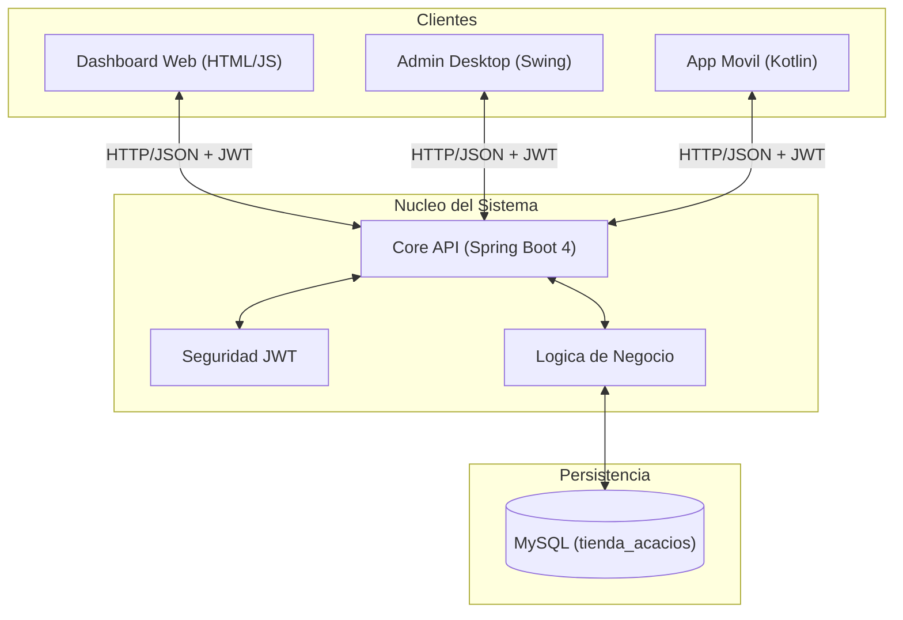
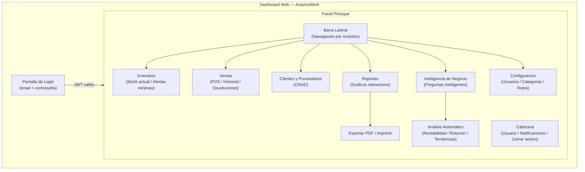
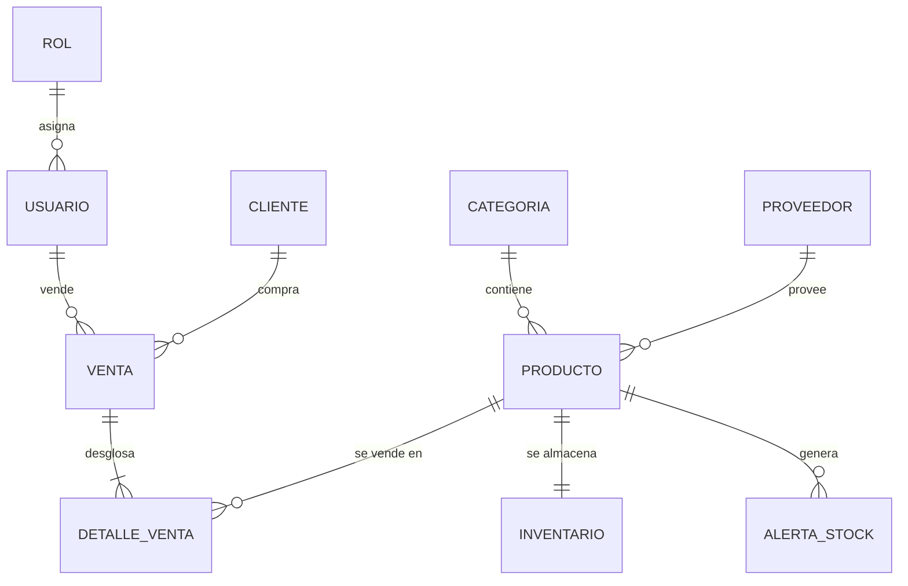

# Buenas Prácticas de Desarrollo de Software
## Proyecto AcaciosWork

**Programa:** Tecnólogo en Análisis y Desarrollo de Software | SENA – Ficha 3118313
**Autor:** Rubiel Andrés Díaz Jiménez
**Fecha:** Julio 2026

---

## 1. Empresa

| Campo | Detalle |
| :--- | :--- |
| **Nombre** | Tienda Los Acacios |
| **Tipo de negocio** | Comercio minorista (tienda de barrio) |
| **Descripción** | Tienda de barrio dedicada a la comercialización de abarrotes, frutas, verduras, bebidas y productos de primera necesidad. |
| **Público objetivo** | Habitantes del barrio y sectores cercanos que buscan productos de primera necesidad de forma rápida y económica. |

**Misión:** Brindar atención amable y ofrecer productos de calidad a precios accesibles para satisfacer las necesidades diarias de la comunidad.

**Visión:** Modernizar la administración del negocio mediante herramientas tecnológicas para mejorar el servicio, fidelizar clientes y aumentar las ventas.

**Objetivo:** Ofrecer productos de primera necesidad con calidad, disponibilidad y precios competitivos.

**Ventajas competitivas:**
- Atención personalizada y cercana al cliente.
- Productos frescos y de calidad con precios competitivos.
- Servicio rápido y confiable con conocimiento de las necesidades del barrio.

---

## 2. Proyecto de Software

**Nombre del Proyecto:** AcaciosWork
**Descripción:** Plataforma inteligente de gestión empresarial (ERP/POS) multiplataforma para la Tienda Los Acacios. Combina gestión operativa (inventarios, ventas, clientes) con inteligencia de negocio automatizada. Arquitectura **SaaS** con un núcleo API centralizado y múltiples interfaces de cliente.

---

## 3. Proceso de Desarrollo de Software

El ciclo de vida del proyecto siguió las fases estándar de la ingeniería de software:

| Fase | Actividad Principal |
| :--- | :--- |
| **Análisis** | Levantamiento de requisitos funcionales y no funcionales, viabilidad técnica. |
| **Diseño** | Arquitectura del sistema, modelo de datos ERD, diseño de interfaces. |
| **Implementación** | Codificación por módulos con estándares de nomenclatura y documentación. |
| **Pruebas** | Pruebas funcionales por módulo y pruebas de integración API-cliente. |
| **Mantenimiento** | Correctivo (bugs), adaptativo (nuevos entornos) y perfectivo (nuevas funciones). |

---

## 4. Tecnologías

| Módulo | Stack Tecnológico |
| :--- | :--- |
| **Backend (Core API)** | Java 25 · Spring Boot 4.0.6 · Spring Security · JPA/Hibernate · MySQL 8.0 |
| **Frontend Web** | HTML5 · CSS3 · JavaScript Vanilla ES6+ · Thymeleaf |
| **App Desktop** | Java 25 · Swing · FlatLaf · Jackson |
| **App Móvil** | Kotlin 2.x · Android SDK · Jetpack Compose · MVVM · Retrofit |
| **Base de Datos** | MySQL 8.0 — esquema `tienda_acacios` |
| **Seguridad** | JSON Web Token (JWT) |
| **Construcción** | Maven (`pom.xml`) |
| **Documentación** | Markdown · Mermaid Diagrams |

---

## 5. Diagramas

### 5.1 Arquitectura General del Sistema



### 5.2 Diagrama de UI — Versión Web (Dashboard)



### 5.3 Flujo de Datos


### 5.4 Modelo de Datos (ERD Simplificado)



---

## 6. Metodología

Se adoptó un enfoque **ágil iterativo** inspirado en **Scrum**, adaptado a un equipo unipersonal:

| Práctica | Aplicación en AcaciosWork |
| :--- | :--- |
| **Sprints** | Incrementos funcionales por módulo (auth → inventario → ventas → BI). |
| **Product Backlog** | Requisitos priorizados registrados en `project-context.md`. |
| **Revisión continua** | Validación funcional al finalizar cada módulo antes de continuar. |
| **PSP (Personal Software Process)** | Registro de tiempo por tarea y log de defectos personales. |

---

## 7. Herramientas

| Categoría | Herramientas |
| :--- | :--- |
| **IDE / Edición** | VS Code · IntelliJ IDEA |
| **Control de Versiones** | Git · GitHub |
| **Construcción** | Apache Maven |
| **Pruebas API** | Postman |
| **Base de Datos** | MySQL Workbench |
| **Documentación** | Markdown · Mermaid |
| **IA / Asistencia** | Antigravity IDE (Google DeepMind) · Graphify |

---

## 8. Arquitectura

Arquitectura **multicapa y multi-cliente** con un Backend centralizado como único punto de verdad:

```
AcaciosWork/
├── acacioswork-backend/    # Core API REST (Spring Boot)
│   ├── config/             # Seguridad, JWT, CORS
│   ├── controller/         # Endpoints REST
│   ├── service/            # Lógica de negocio
│   ├── model/              # Entidades JPA
│   └── repository/         # Acceso a datos (Spring Data)
├── acacioswork-desktop/    # App Escritorio (Java Swing)
├── acacioswork-frontend/   # Dashboard Web (HTML/JS/Thymeleaf)
│   ├── static/js/core/     # api.js · auth.js · utils.js
│   ├── static/js/modules/  # ventas/ · inventario/ · reportes/ · inteligencia/
│   └── static/js/shared/   # modal.js · notificacion.js · exportador-pdf.js
└── acacioswork-android/    # App Móvil (Kotlin / Jetpack Compose)
```

**Principios de arquitectura:**
- **Aislamiento total:** Solo el Backend accede a MySQL. Los clientes son 100% dependientes de la API.
- **Single Source of Truth:** Un solo esquema de datos para todos los clientes.
- **Escalabilidad:** Diseñado como SaaS para servir múltiples plataformas simultáneamente.

---

## 9. Buenas Prácticas Aplicadas

### Nomenclatura (Naming Conventions)

| Convención | Uso | Ejemplo |
| :--- | :--- | :--- |
| `camelCase` | Variables, métodos, funciones JS/Java/Kotlin | `stockActual`, `registrarVenta()` |
| `PascalCase` | Clases, interfaces, componentes | `AlertaStockMinimo`, `UsuarioController` |
| `snake_case` | Tablas y columnas MySQL | `alertas_stock_minimo`, `id_producto` |
| `kebab-case` | Clases CSS, archivos HTML/JS | `btn-primary`, `administrador-dashboard.html` |
| `UPPER_SNAKE_CASE` | Constantes globales | `MAX_RETRY_ATTEMPTS` |

### Documentación de Código

Todo bloque de código incluye descripción funcional y firma de autor:

```java
/** Registra una nueva venta y actualiza el stock. @author RADJ */
```
```css
/* Estilos del panel principal del dashboard. @author RADJ */
```
```html
<!-- Fragmento de cabecera compartida. @author RADJ -->
```

---

## 10. Codificación

- **Separación de responsabilidades:** Lógica de negocio en `Service`, nunca en `Controller`.
- **Entidades limpias:** Uso de **Lombok** para eliminar boilerplate (getters, setters, constructores).
- **Frontend modular:** Scripts JS organizados en `core/`, `modules/` y `shared/` para máxima reutilización.
- **Modelo homogéneo:** Campos de datos consistentes en todas las capas (`stockActual`, `stockMinimo`, `stockOptimo`, `unidadMedida`).

---

## 11. Estándares de Calidad

El proyecto se alinea con los siguientes marcos:

| Estándar | Aplicación |
| :--- | :--- |
| **ISO/IEC 25000 (SQuaRE)** | Evaluación de calidad del producto: funcionalidad, fiabilidad, mantenibilidad. |
| **ISO/IEC 9126** | Corrección, eficiencia, portabilidad e interoperabilidad como criterios de diseño. |
| **CMMI Nivel 2** | Procesos planificados y monitoreados; desarrollo repetible y estable. |
| **Estándar de código** | Todo código documentado con descripción funcional y firma de autor. |
| **IDs estandarizados** | `BIGINT UNSIGNED` en MySQL <-> `Long` en Java, en todas las capas. |

---

## 12. Seguridad

| Mecanismo | Detalle |
| :--- | :--- |
| **Autenticación JWT** | Token Bearer obligatorio en todas las peticiones privadas. |
| **Spring Security** | Control de acceso por roles (`ADMIN`, `AUXILIAR`) en el backend. |
| **CORS configurado** | Solo orígenes autorizados pueden consumir la API. |
| **Aislamiento de BD** | Ningún cliente accede directamente a MySQL; todo pasa por la API. |
| **Credenciales externas** | Configuración sensible en `application.properties`, fuera del código fuente. |

---

## 13. Tipos de Pruebas

| Tipo de Prueba | Descripción | Herramienta |
| :--- | :--- | :--- |
| **Pruebas unitarias** | Validación de lógica aislada por método/servicio. | JUnit (Java) |
| **Pruebas de integración** | Verificación de la comunicación entre capas (API <-> BD). | Spring Boot Test |
| **Pruebas de API (Caja negra)** | Validación de endpoints REST con datos reales. | Postman |
| **Pruebas funcionales (UAT)** | Validación de flujos completos: login → venta → reporte. | Manual |
| **Pruebas de regresión** | Re-verificación de módulos anteriores tras nuevos cambios. | Manual + Postman |
| **Pruebas de interfaz** | Validación de responsividad y consistencia visual del dashboard web. | Manual (Chrome DevTools) |

---

## 14. Procesos de Construcción

1. **Gestión de dependencias:** Maven centraliza librerías del backend (`pom.xml`). Gradle en Android.
2. **Construcción del backend:** `mvn spring-boot:run` — incluye compilación, empaquetado y arranque del servidor.
3. **Frontend integrado:** Las vistas web (Thymeleaf) son servidas directamente por el backend desde `localhost:8081`.
4. **Base de datos:** Importación del script `database/tienda_acacios.sql` para inicializar el esquema.
5. **Control de versiones:** Cada módulo funcional se desarrolla y consolida con commits descriptivos en Git/GitHub.

---

## 15. Pruebas y Calidad

Ciclo de vida de un bug detectado (basado en ISO/IEC/IEEE 29119-3):

```
Nuevo → Asignado → Corregido → Re-Test → Cerrado
```

Los artefactos de calidad generados son:
- **Plan de Pruebas** — alcance, criterios de entrada/salida y riesgos.
- **Casos de Prueba (CP)** — condición, precondición y resultado esperado por escenario.
- **Scripts de Prueba (SCR)** — pasos detallados de ejecución manual.
- **Reporte de Incidencias (BUG)** — severidad, prioridad, pasos de reproducción y estado.

---

## 16. Refactorización

Hitos de refactorización registrados en el historial del proyecto:

| Fecha | Cambio Realizado |
| :--- | :--- |
| 2026-05-22 | Renombrado `cantidad` → `stockActual` en todas las capas (BD, Backend, Desktop, Web, Android). |
| 2026-05-22 | Adición de `stockOptimo` y `unidadMedida` al modelo de `Producto` en todo el ecosistema. |
| 2026-05-23 | Migración del frontend estático a Thymeleaf integrado en Spring Boot. Eliminación de HTML/CSS/JS huérfanos. |
| 2026-06-04 | Extracción de scripts embebidos en HTML hacia archivos JS externos en `core/`, `modules/` y `shared/`. |

---

## 17. Etapa Actual del Proyecto

**Estado:** `DESARROLLO ACTIVO — FASE DE ESTABILIZACIÓN Y ESCALADO`

### Completado
- Autenticación JWT en todas las plataformas (Web, Desktop, Android).
- CRUDs operativos: Usuarios, Clientes, Proveedores, Categorías, Productos e Inventario.
- Módulo de Ventas y DetalleVenta con persistencia atómica.
- Inteligencia de Negocio: módulo de "Preguntas Inteligentes" y gráficos interactivos en la web.
- Exportación a PDF e impresión de comprobantes en el dashboard web.
- App Android funcional: Login, Dashboard, Clientes, Inventario, Proveedores.

### En Proceso
- Sistema de alertas en tiempo real para stock crítico.
- Reportes con gráficos en la app Desktop y Android.
- Módulo de Cierre de Caja (balance diario).

---

*Documento generado como parte del proceso formativo del SENA — Ficha 3118313.*
*Autor: Rubiel Andrés Díaz Jiménez | AcaciosWork © 2026*
