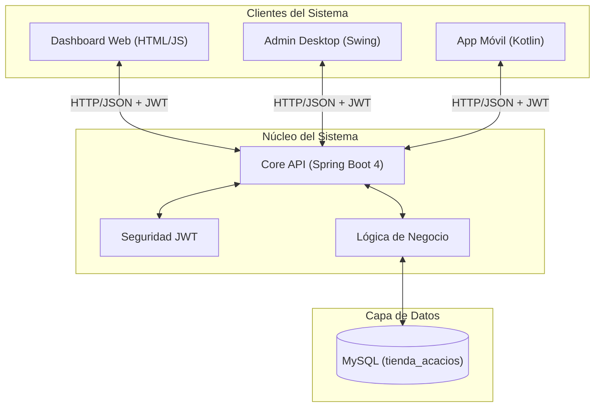
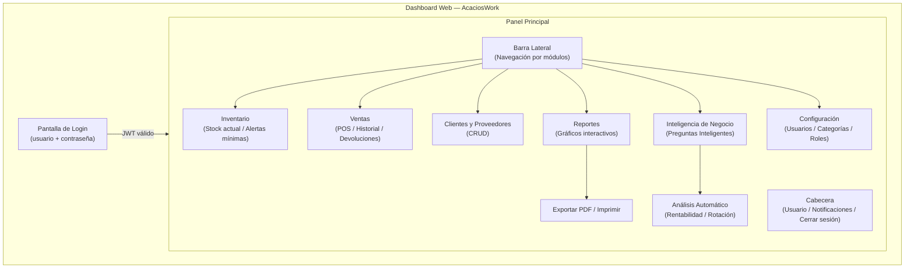
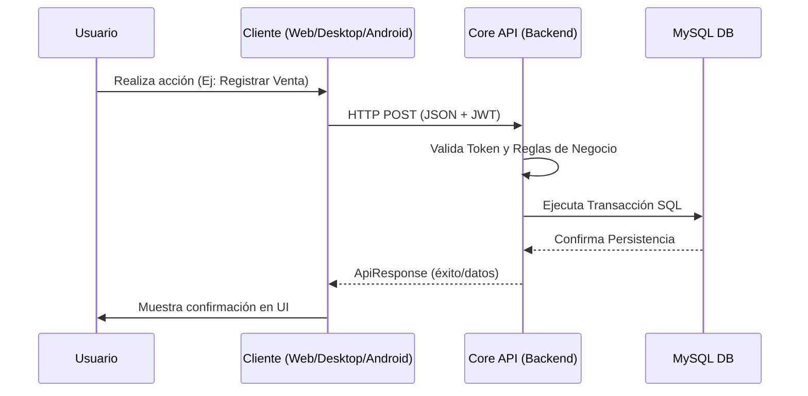
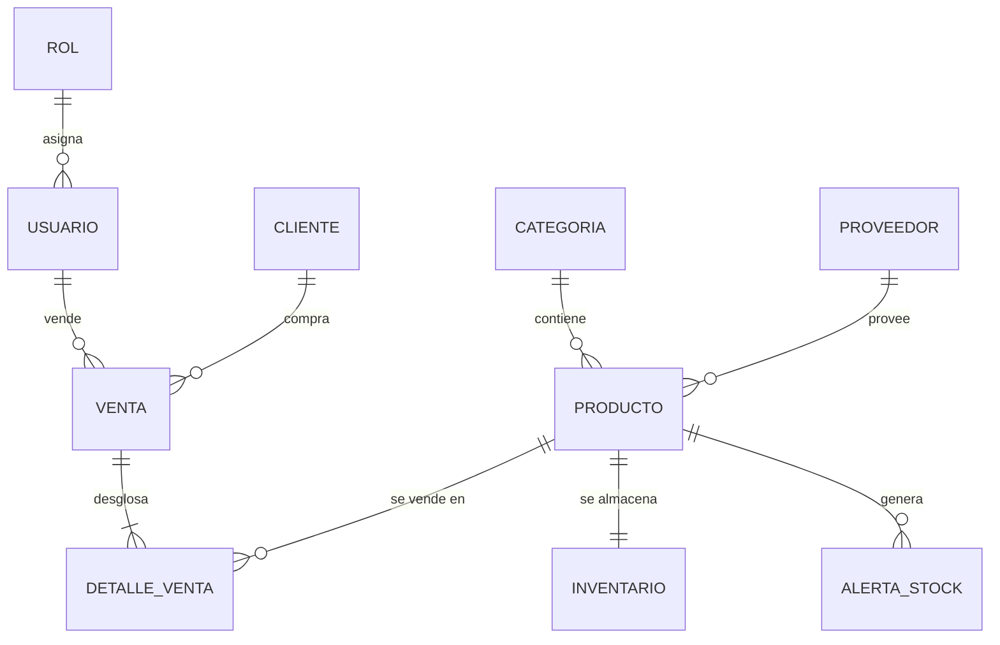

# Buenas Prácticas de Desarrollo de Software
## Ecosistema de Software AcaciosWork

---

### Presentación del Documento

* **Institución:** Servicio Nacional de Aprendizaje (SENA)
* **Programa de Formación:** Tecnólogo en Análisis y Desarrollo de Software (ADSO)
* **Ficha:** 3118313
* **Autor / Desarrollador:** Rubiel Andrés Díaz Jiménez
* **Proyecto:** AcaciosWork — Sistema ERP/POS Multiplataforma
* **Organización Beneficiaria:** Tienda Los Acacios
* **Lugar y Fecha:** Colombia, Julio de 2026

---

## Tabla de Contenido

- [1. Introducción](#1-introducción)
- [2. Objetivos](#2-objetivos)
  - [2.1. Objetivo General](#21-objetivo-general)
  - [2.2. Objetivos Específicos](#22-objetivos-específicos)
- [3. Perfil de la Empresa](#3-perfil-de-la-empresa)
  - [3.1. Identificación y Descripción](#31-identificación-y-descripción)
  - [3.2. Misión, Visión y Objetivos Organizacionales](#32-misión-visión-y-objetivos-organizacionales)
  - [3.3. Ventajas Competitivas](#33-ventajas-competitivas)
- [4. Descripción del Proyecto de Software](#4-descripción-del-proyecto-de-software)
  - [4.1. Alcance del Sistema](#41-alcance-del-sistema)
  - [4.2. Propuesta de Valor](#42-propuesta-de-valor)
- [5. Proceso y Ciclo de Vida del Desarrollo](#5-proceso-y-ciclo-de-vida-del-desarrollo)
  - [5.1. Fases del Ciclo de Vida](#51-fases-del-ciclo-de-vida)
  - [5.2. Metodología de Trabajo](#52-metodología-de-trabajo)
- [6. Stack Tecnológico](#6-stack-tecnológico)
  - [6.1. Componentes del Núcleo y Clientes](#61-componentes-del-núcleo-y-clientes)
  - [6.2. Herramientas de Desarrollo y Gestión](#62-herramientas-de-desarrollo-y-gestión)
- [7. Arquitectura y Modelo del Sistema](#7-arquitectura-y-modelo-del-sistema)
  - [7.1. Principios Arquitectónicos](#71-principios-arquitectónicos)
  - [7.2. Estructura Multicapa del Repositorio](#72-estructura-multicapa-del-repositorio)
  - [7.3. Diagramas del Sistema](#73-diagramas-del-sistema)
    - [7.3.1. Arquitectura General](#731-arquitectura-general)
    - [7.3.2. Interfaz de Usuario Web](#732-interfaz-de-usuario-web)
    - [7.3.3. Flujo de Datos Transaccional](#733-flujo-de-datos-transaccional)
    - [7.3.4. Modelo de Datos (ERD)](#734-modelo-de-datos-erd)
- [8. Estándares de Codificación y Calidad](#8-estándares-de-codificación-y-calidad)
  - [8.1. Convenciones de Nomenclatura](#81-convenciones-de-nomenclatura)
  - [8.2. Documentación e Identificación de Código](#82-documentación-e-identificación-de-código)
  - [8.3. Patrones de Codificación y Modularidad](#83-patrones-de-codificación-y-modularidad)
  - [8.4. Alineación con Normas Internacionales](#84-alineación-con-normas-internacionales)
- [9. Seguridad y Protección de Datos](#9-seguridad-y-protección-de-datos)
  - [9.1. Autenticación y Autorización](#91-autenticación-y-autorización)
  - [9.2. Aislamiento de Capas](#92-aislamiento-de-capas)
- [10. Aseguramiento de Calidad y Pruebas](#10-aseguramiento-de-calidad-y-pruebas)
  - [10.1. Tipos de Pruebas Ejecutadas](#101-tipos-de-pruebas-ejecutadas)
  - [10.2. Ciclo de Gestión de Incidencias](#102-ciclo-de-gestión-de-incidencias)
  - [10.3. Procesos de Construcción (Build)](#103-procesos-de-construcción-build)
- [11. Mantenimiento y Refactorización](#11-mantenimiento-y-refactorización)
  - [11.1. Historial de Refactorizaciones Relevantes](#111-historial-de-refactorizaciones-relevantes)
  - [11.2. Estado Actual del Proyecto](#112-estado-actual-del-proyecto)
- [12. Conclusiones](#12-conclusiones)

---

## 1. Introducción

El presente documento recopila los lineamientos técnicos, estándares de ingeniería y buenas prácticas aplicados en el diseño, desarrollo e implementación del ecosistema **AcaciosWork**. Este proyecto surge ante la necesidad de modernizar la gestión operativa y comercial de **Tienda Los Acacios**, una microempresa del sector minorista de abarrotes.

A lo largo del proceso formativo en Análisis y Desarrollo de Software (SENA), se ha concebido una solución multiplataforma que adopta una arquitectura orientada a servicios (SaaS), garantizando la centralización de los datos, el aislamiento de la base de datos MySQL y la interoperabilidad entre aplicaciones Web, Escritorio y Móviles. El cumplimiento de estándares como ISO/IEC 25000 (SQuaRE), CMMI Nivel 2 y prácticas de codificación limpia ha permitido estructurar una plataforma robusta, escalable y mantenible.

---

## 2. Objetivos

### 2.1. Objetivo General

Consolidar e implementar las buenas prácticas de ingeniería de software en el desarrollo del sistema ERP/POS multiplataforma **AcaciosWork**, optimizando la administración de inventario, ventas, clientes y toma de decisiones en la Tienda Los Acacios.

### 2.2. Objetivos Específicos

- **Establecer una arquitectura sólida y segura:** Implementar un núcleo centralizado con Spring Boot y autenticación JWT que actúe como único punto de acceso a la persistencia en MySQL.
- **Estandarizar el desarrollo de código:** Aplicar convenciones estricta de nomenclatura, patrones de diseño (MVVM, Layered Architecture) y firma documental de código (`@author RADJ`).
- **Garantizar la calidad del producto:** Estructurar planes de pruebas unitarias, de integración y funcionales bajo los marcos de calidad ISO/IEC 25000 e ISO/IEC 9126.
- **Facilitar la mantenibilidad y escalabilidad:** Organizar modularmente los componentes del frontend y backend para permitir la refactorización continua y la adición de nuevas funcionalidades sin afectar la estabilidad del sistema.

---

## 3. Perfil de la Empresa

### 3.1. Identificación y Descripción

| Campo | Detalle |
| :--- | :--- |
| **Nombre** | Tienda Los Acacios |
| **Tipo de negocio** | Comercio minorista (tienda de barrio / abarrotes) |
| **Descripción** | Tienda dedicada a la comercialización de abarrotes, frutas, verduras, bebidas y productos de primera necesidad. |
| **Público objetivo** | Habitantes del sector urbano local que requieren abastecimiento rápido, cercano y económico. |

### 3.2. Misión, Visión y Objetivos Organizacionales

- **Misión:** Brindar atención amable y ofrecer productos de primera necesidad de alta calidad a precios accesibles para satisfacer las demandas diarias de la comunidad.
- **Visión:** Modernizar la administración del negocio mediante herramientas tecnológicas de vanguardia para mejorar el servicio, fidelizar clientes y maximizar la rentabilidad operativa.
- **Objetivo:** Garantizar la disponibilidad constante de productos esenciales con precios competitivos mediante un control eficiente de inventarios.

### 3.3. Ventajas Competitivas

- Atención personalizada y cercanía con la comunidad local.
- Disponibilidad constante de productos frescos con rotación optimizada.
- Agilidad en el servicio de caja y atención al cliente.

---

## 4. Descripción del Proyecto de Software

### 4.1. Alcance del Sistema

**AcaciosWork** es una plataforma integral de gestión empresarial (ERP/POS) multiplataforma. Permite administrar de manera centralizada catálogos de productos, inventario con cálculo de stock crítico y óptimo, ventas en punto de pago, registro de clientes, proveedores y usuarios con permisos basados en roles.

### 4.2. Propuesta de Valor

Además del control operativo tradicional, AcaciosWork integra un **Módulo de Inteligencia de Negocio ("Preguntas Inteligentes")** que procesa métricas financieras y comerciales en tiempo real, permitiendo al comerciante identificar productos de alta/baja rotación, estimar rentabilidad neta y predecir desabastecimientos desde cualquier dispositivo.

---

## 5. Proceso y Ciclo de Vida del Desarrollo

### 5.1. Fases del Ciclo de Vida

El ciclo de vida del software se estructuró en cinco fases fundamentales:

| Fase | Actividad Principal |
| :--- | :--- |
| **Análisis** | Levantar requisitos funcionales/no funcionales y validar la viabilidad operativa en tienda. |
| **Diseño** | Definir arquitectura multiplataforma, modelo entidad-relación (ERD) e interfaces de usuario. |
| **Implementación** | Codificar módulos backend y frontend bajo estándares de calidad y control de versiones. |
| **Pruebas** | Ejecutar pruebas de API con Postman, validación de UI y pruebas unitarias aisladas. |
| **Mantenimiento** | Aplicar refactorización correctiva y perfectiva sobre módulos existentes. |

### 5.2. Metodología de Trabajo

Se implementó un marco **ágil iterativo e incremental** adaptado para desarrollo personal (PSP - Personal Software Process) con sprints enfocados en componentes específicos (Autenticación → Inventario → Ventas POS → Reportes e Inteligencia).

---

## 6. Stack Tecnológico

### 6.1. Componentes del Núcleo y Clientes

| Módulo / Capa | Tecnologías Seleccionadas |
| :--- | :--- |
| **Backend (Core API)** | Java 25 · Spring Boot 4.0.6 · Spring Security · JPA / Hibernate |
| **Frontend Web** | HTML5 · CSS3 Vanilla · JavaScript ES6+ · Thymeleaf Template Engine |
| **App Desktop** | Java 25 · Swing Framework · FlatLaf Look & Feel · Jackson JSON |
| **App Móvil** | Kotlin 2.x · Android SDK · Jetpack Compose · Architecture MVVM · Retrofit |
| **Base de Datos** | MySQL 8.0 (Esquema `tienda_acacios`) |
| **Seguridad** | JSON Web Token (JWT) con encriptación de claves |

### 6.2. Herramientas de Desarrollo y Gestión

- **IDE / Editores:** VS Code, IntelliJ IDEA, Android Studio.
- **Control de Versiones y Build:** Git, GitHub, Apache Maven.
- **Pruebas de API y BD:** Postman, MySQL Workbench.
- **Documentación y Diagramado:** Markdown, Mermaid Diagrams.

---

## 7. Arquitectura y Modelo del Sistema

### 7.1. Principios Arquitectónicos

1. **Aislamiento Total de Persistencia:** Únicamente el Backend Core tiene permiso para conectarse a la base de datos MySQL.
2. **Single Source of Truth (Fuente Única de Verdad):** Todos los clientes (Web, Desktop, Móvil) consumen la misma API REST.
3. **Desacoplamiento Client-Server:** La lógica de negocio reside exclusivamente en los servicios Java del Backend.

### 7.2. Estructura Multicapa del Repositorio

```
AcaciosWork/
├── acacioswork-backend/    # Core API REST (Spring Boot)
│   ├── config/             # Seguridad, JWT, CORS
│   ├── controller/         # Endpoints REST
│   ├── service/            # Lógica de negocio
│   ├── model/              # Entidades JPA
│   └── repository/         # Acceso a datos (Spring Data)
├── acacioswork-desktop/    # App Escritorio (Java Swing)
├── acacioswork-frontend/   # Dashboard Web (HTML/JS/Thymeleaf)
│   ├── static/js/core/     # api.js · auth.js · utils.js
│   ├── static/js/modules/  # ventas/ · inventario/ · reportes/ · inteligencia/
│   └── static/js/shared/   # modal.js · notificacion.js · exportador-pdf.js
└── acacioswork-android/    # App Móvil (Kotlin / Jetpack Compose)
```

### 7.3. Diagramas del Sistema

#### 7.3.1. Arquitectura General



#### 7.3.2. Interfaz de Usuario Web



#### 7.3.3. Flujo de Datos Transaccional



#### 7.3.4. Modelo de Datos (ERD)



---

## 8. Estándares de Codificación y Calidad

### 8.1. Convenciones de Nomenclatura

| Caso de Uso | Convención | Ejemplo |
| :--- | :--- | :--- |
| **Variables y Métodos** | `camelCase` | `stockActual`, `calcularTotalVenta()` |
| **Clases e Interfaces** | `PascalCase` | `ProductoController`, `VentaService` |
| **Base de Datos** | `snake_case` | `alertas_stock`, `fecha_hora` |
| **Archivos HTML / CSS** | `kebab-case` | `administrador-dashboard.html`, `main-styles.css` |
| **Constantes** | `UPPER_SNAKE_CASE` | `DEFAULT_TAX_RATE` |

### 8.2. Documentación e Identificación de Código

Cada clase, método relevante o archivo script debe llevar documentación explícita y la firma del autor:

```java
/** Registra una nueva venta validando disponibilidad de stock. @author RADJ */
```

### 8.3. Patrones de Codificación y Modularidad

- **Inyección de Dependencias:** Uso de anotaciones Spring (`@Service`, `@RestController`, `@Autowired`).
- **Lombok Integration:** Reducción de código repetitivo en modelos Java.
- **JavaScript Modular:** Organización estricta en carpetas `core/` (servicios base), `modules/` (lógica de vistas) y `shared/` (componentes globales).

### 8.4. Alineación con Normas Internacionales

- **ISO/IEC 25000 (SQuaRE):** Criterios de evaluación de calidad en mantenibilidad, seguridad y adecuación funcional.
- **ISO/IEC 9126:** Aseguramiento de atributos de usabilidad, eficiencia y portabilidad.
- **CMMI Nivel 2:** Gestión de configuración y trazabilidad de cambios en desarrollo.

---

## 9. Seguridad y Protección de Datos

### 9.1. Autenticación y Autorización

- Implementación de **JSON Web Tokens (JWT)** para la gestión de sesiones sin estado (stateless).
- Restricción de acceso a endpoints basada en roles de usuario (`ADMINISTRADOR` y `AUXILIAR`).

### 9.2. Aislamiento de Capas

- Ningún cliente frontend o móvil posee credenciales de base de datos.
- Configuración centralizada de políticas CORS para filtrar peticiones de orígenes no autorizados.

---

## 10. Aseguramiento de Calidad y Pruebas

### 10.1. Tipos de Pruebas Ejecutadas

| Nivel de Prueba | Alcance | Herramienta / Método |
| :--- | :--- | :--- |
| **Pruebas Unitarias** | Validación lógica de métodos de negocio aislados. | JUnit / Mockito |
| **Pruebas de Integración** | Comunicación entre Controladores, Servicios y Repositorios JPA. | Spring Boot Test |
| **Pruebas de API** | Verificación de respuestas JSON, códigos HTTP y payloads. | Postman Collections |
| **Pruebas de UI y UAT** | Validación de usabilidad y flujo continuo en navegadores y dispositivos. | Manual / Chrome DevTools |

### 10.2. Ciclo de Gestión de Incidencias

Flujo estandarizado conforme a ISO/IEC/IEEE 29119-3:

`Detectado → Reportado (BUG) → Asignado → Corregido → Re-Test → Cerrado`

### 10.3. Procesos de Construcción (Build)

Uso de **Apache Maven** para la gestión automatizada de dependencias y empaquetado JAR ejecutable del backend (`mvn clean package`).

---

## 11. Mantenimiento y Refactorización

### 11.1. Historial de Refactorizaciones Relevantes

| Fecha | Descripción de Cambio | Impacto |
| :--- | :--- | :--- |
| **2026-05-22** | Estandarización del campo `stockActual` en todas las capas del sistema. | Eliminó inconsistencias entre capas de datos. |
| **2026-06-04** | Modularización completa de scripts JS en el frontend web (`core/`, `modules/`, `shared/`). | Eliminó la dependencia de scripts globales gigantes. |
| **2026-07-26** | Depuración de archivos legacy (`dashboard.js` de 1800 líneas) y corrección de referencias en `login.html`. | Reducción de 86 KB de código muerto e independización modular. |

### 11.2. Estado Actual del Proyecto

El sistema se encuentra en **Fase de Estabilización y Despliegue**, con los módulos principales (Autenticación, Inventario, POS Ventas, Clientes, Proveedores, Inteligencia de Negocio y Reportes) totalmente funcionales e integrados.

---

## 12. Conclusiones

1. **Eficiencia Arquitectónica:** La adopción de una arquitectura centrada en una API REST uniforme demostró ser la estrategia adecuada para escalar la solución a múltiples plataformas (Web, Desktop y Móvil) manteniendo una única fuente de verdad.
2. **Impacto de las Buenas Prácticas:** La aplicación rigurosa de estándares de codificación, convenciones de nombres y modularidad facilitó el mantenimiento, permitiendo refactorizaciones profundas (como la eliminación del código legacy `dashboard.js`) sin interrumpir la operación del sistema.
3. **Valor para el Negocio:** AcaciosWork no solo resuelve los problemas de gestión operativa de Tienda Los Acacios, sino que aporta un valor diferenciador mediante la analítica de datos en tiempo real, transformando el control tradicional de existencias en una herramienta estratégica.

---

*Documento elaborado conforme a los requerimientos del programa ADSO — SENA.*  
*AcaciosWork © 2026 | Desarrollado por Rubiel Andrés Díaz Jiménez*
