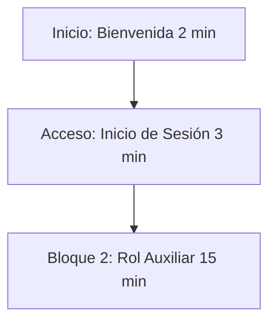
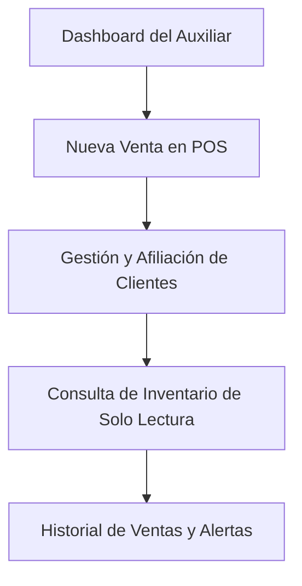
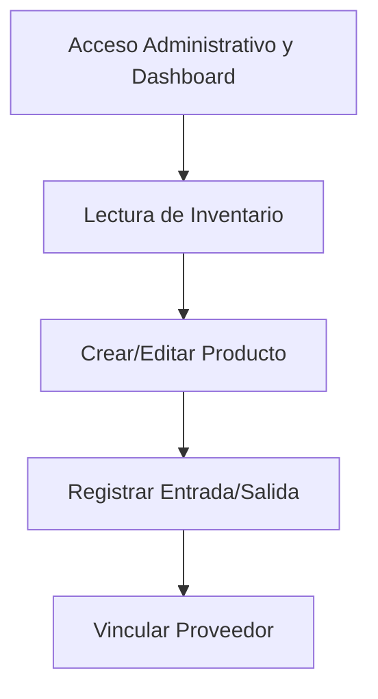
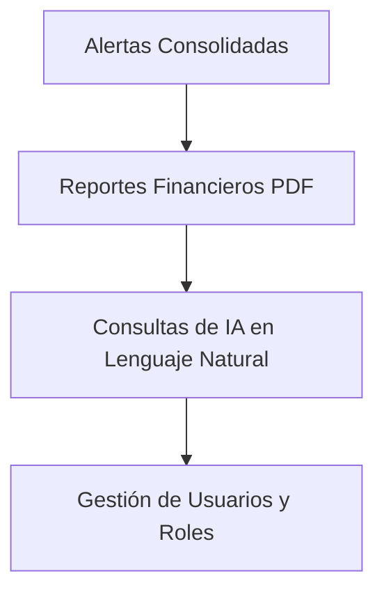

# 🎯 Guión y Plan de Capacitación - AcaciosWork
*Versión 1.1 — Guía Metodológica para la Capacitación de Usuarios Finales (45 Minutos)*

**Autor:** Rubiel Andrés Díaz  
**Contacto:** andresrubiel@gmail.com  
**Copyright © 2026 Rubiel Andrés Díaz**

---

## 📝 Introducción

En el dinámico entorno comercial actual, la adopción exitosa de tecnologías de gestión de inventarios y puntos de venta (POS) depende fundamentalmente de la preparación de los usuarios finales. El presente documento establece el **Guión y Plan de Capacitación** para **AcaciosWork**, estructurado minuciosamente para completarse en una sesión práctica e intensiva de **45 minutos**. 

Este plan proporciona al facilitador o instructor una guía metodológica y un libreto narrativo detallado, organizando los tiempos y temas según los diferentes roles del negocio (**Auxiliares/Cajeros**, **Encargados de Bodega** y **Administradores**). El objetivo es familiarizar al personal con la interfaz gráfica mediante la inserción de imágenes del sistema en tiempo real para cada rol, automatizar tareas cotidianas y mitigar el riesgo operativo mediante la manipulación directa de la plataforma.

---

## 📌 Tabla de Contenido
- [📝 Introducción](#-introducción)
- [🎯 Objetivos de la Capacitación](#-objetivos-de-la-capacitación)
- [📌 Ficha Técnica del Plan de Capacitación](#-ficha-técnica-del-plan-de-capacitación)
- [⏰ Cronograma General (45 Minutos)](#-cronograma-general-45-minutos)
- [🗣️ Libreto Detallado Paso a Paso](#️-libreto-detallado-paso-a-paso)
  - 1. [🔑 Bloque de Introducción (00:00 - 00:05)](#1-bloque-de-introducción-0000---0005)
  - 2. [🔵 Bloque de Capacitación del Auxiliar y Punto de Venta (00:05 - 00:20)](#2-bloque-de-capacitación-del-auxiliar-y-punto-de-venta-0005---0020)
  - 3. [🔴 Bloque de Gestión de Inventario y Dashboard Administrativo (00:20 - 00:32)](#3-bloque-de-gestión-de-inventario-y-dashboard-administrativo-0020---0032)
  - 4. [⚙️ Bloque de Administración y Herramientas Inteligentes (00:32 - 00:40)](#4-bloque-de-administración-y-herramientas-inteligentes-0032---0040)
  - 5. [🚪 Bloque de Cierre y Preguntas (00:40 - 00:45)](#5-bloque-de-cierre-y-preguntas-0040---0045)
- [📈 Plan de Evaluación Post-Capacitación](#-plan-de-evaluación-post-capacitación)
- [🏁 Conclusiones del Plan de Capacitación](#-conclusiones-del-plan-de-capacitación)

---

## 🎯 Objetivos de la Capacitación

### Objetivo General
Capacitar al personal administrativo, operativo y de ventas en el uso ágil y correcto de la plataforma web **AcaciosWork** en una sesión guiada de 45 minutos, garantizando la comprensión de sus funciones clave según el rol de cada usuario.

### Objetivos Específicos
* **Cajeros / Vendedores:** Dominar el módulo de Punto de Venta (POS) para buscar productos, estructurar el carrito de compras, registrar clientes nuevos y completar transacciones en menos de 30 segundos.
* **Encargados de Bodega / Inventario:** Interpretar el semáforo visual de stock crítico, registrar movimientos de entrada/salida de mercancía de forma justificada y gestionar la base de datos de proveedores.
* **Administradores / Propietarios:** Interpretar los tableros de control financiero (Dashboard y Reportes), exportar resúmenes en formato PDF para contabilidad, y utilizar el asistente de Inteligencia Artificial para consultas rápidas en lenguaje natural.
* **Seguridad y Soporte:** Fomentar prácticas seguras como el manejo de credenciales personales y el cierre correcto de la sesión activa al finalizar la jornada.

---

## 📌 Ficha Técnica del Plan de Capacitación

* **Nombre del Taller:** Implementación Eficiente y Operación de AcaciosWork
* **Duración Total:** 45 Minutos
* **Audiencia Objetivo:** Cajeros (Operadores POS), Encargados de Inventario/Bodega, y Administradores/Propietarios del Negocio.
* **Metodología:** Demostración en vivo (60%) + Práctica guiada en tiempo real (30%) + Preguntas y respuestas (10%).
* **Materiales Requeridos:**
  * Computador para el instructor conectado a proyector o pantalla compartida.
  * Computadores/dispositivos de práctica para los usuarios (con acceso a internet y navegador web).
  * Credenciales de acceso de prueba previamente creadas para cada rol.
  * Copia digital o física del [Manual de Usuario del Administrador](file:///C:/copia%20de%20proyecto%20Acacios%20Work/AcaciosWork/Manual%20de%20usuario/MANUAL_USUARIO_%20ADMINISTRADOR.md) y del [Manual de Usuario del Auxiliar](file:///C:/copia%20de%20proyecto%20Acacios%20Work/AcaciosWork/manual%20usuario%20auxiliar/MANUAL_USUARIO_AUXILIAR.md).

---

## ⏰ Cronograma General (45 Minutos)

| Bloque | Duración | Módulo / Tema | Roles Involucrados |
| :--- | :---: | :--- | :--- |
| **1. Introducción** | 05 min | Bienvenida, objetivos y acceso inicial | Todos los Roles |
| **2. Rol Auxiliar** | 15 min | Operación del POS Auxiliar, Clientes y Alertas | Auxiliares, Cajeros, Admins |
| **3. Inventario** | 12 min | Gestión de stock (bodega), movimientos y proveedores | Encargados de Bodega, Admins |
| **4. Administración** | 08 min | Reportes, IA, Alertas, Usuarios y Ajustes | Administradores, Propietarios |
| **5. Cierre y Q&A** | 05 min | Preguntas frecuentes, soporte y cierre seguro | Todos los Roles |

---

## 🗣️ Libreto Detallado Paso a Paso

### 1. Bloque de Introducción (00:00 - 00:05)
* **Objetivo:** Captar el interés, validar el acceso del personal y contextualizar la herramienta.

#### ⏱️ Minuto 00:00 - 00:02 | Bienvenida y Agenda
* **Rol Objetivo:** Todos los roles.
* **Diálogo del Facilitador:**
  > *"¡Hola a todos! Bienvenidos a la sesión de capacitación de **AcaciosWork**, el nuevo sistema de ventas e inventario inteligente que optimizará nuestras operaciones diarias. Hoy aprenderemos a registrar ventas rápidamente, controlar existencias sin esfuerzo y tomar decisiones de negocio inteligentes. Todo esto en 45 minutos. Empezaremos con el acceso básico y luego nos dividiremos en las funciones específicas de sus roles."*
* **Acción en Pantalla:** Mostrar la pantalla de inicio de sesión de AcaciosWork.

#### ⏱️ Minuto 00:02 - 00:05 | Acceso al Sistema (Inicio de Sesión)
* **Rol Objetivo:** Todos los roles.
* **Diálogo del Facilitador:**
  > *"Cada uno tiene una tarjeta con su usuario y contraseña temporal. Vamos a ingresar al sistema. En la pantalla verán la interfaz de **Acceso al sistema** (como se muestra abajo). Escriban su usuario asignado, su contraseña con cuidado de las mayúsculas, y hagan clic en el botón naranja **Iniciar Sesión**. Dependiendo del rol asociado a su cuenta (Auxiliar, Encargado de Bodega o Administrador), el sistema les abrirá un panel de control personalizado con las herramientas específicas para su labor."*

* **Acción en Pantalla:** 
  1. Digitar las credenciales de prueba en el formulario.
  2. Hacer clic en **Iniciar Sesión**.
* **Interacción del Usuario:** Ingresar al sistema con sus credenciales de prueba y esperar instrucciones específicas para su rol.

---

### 2. Bloque de Capacitación del Auxiliar y Punto de Venta (00:05 - 00:20)

> [!IMPORTANT]
> 🔵 **INICIO DE LA VISUAL: ROL AUXILIAR (CAJERO / FACTURACIÓN)**  
> *A partir de este momento se detalla el entorno de trabajo del auxiliar, con su panel simplificado y herramientas de venta diaria.*

* **Objetivo:** Capacitar al personal operativo (Auxiliares y Cajeros) en su entorno simplificado de caja, facturación en el Punto de Venta (POS), afiliación de clientes, consultas rápidas de inventario y arqueo al final del turno.

#### ⏱️ Minuto 00:05 - 00:07 | El Dashboard del Auxiliar
* **Rol Objetivo:** Auxiliares de Venta, Cajeros y Administradores.
* **Diálogo del Facilitador:**
  > *"Una vez que el Auxiliar ha iniciado sesión, la pantalla principal o de Inicio muestra un panel simplificado con información operativa básica. Observen la pantalla del **Dashboard** (como se proyecta abajo). Contamos con tres tarjetas superiores que resumen: 'Total Productos', 'Próximos a Vencer' y 'Stock Bajo'. Debajo de estas tarjetas, se encuentra la tabla de stock crítico de artículos con barras de nivel en colores (Verde, Naranja y Rojo) para detectar de inmediato qué productos necesitan reposición."*

* **Acción en Pantalla:** 
  1. Mostrar la pestaña **Inicio** en el panel de auxiliar.
  2. Apuntar a la barra lateral izquierda que solo contiene los módulos del auxiliar (Inicio, Nueva Venta, Clientes, Inventario, Historial y Alertas).
* **Interacción del Usuario:** Explorar la vista de inicio del auxiliar en sus pantallas de práctica.

---

#### ⏱️ Minuto 00:07 - 00:12 | Registro de Ventas en el POS (Nueva Venta)
* **Rol Objetivo:** Auxiliares de Venta, Cajeros y Administradores.
* **Diálogo del Facilitador:**
  > *"Pasemos ahora al módulo **Nueva Venta**. Al ingresar, verán la interfaz de Punto de Venta (POS) vacía (ver abajo). Para registrar una venta, hacemos clic en el buscador superior: si contamos con lector de código de barras pasamos el producto, o podemos digitar las primeras letras del nombre. La lista desplegable nos mostrará sugerencias en tiempo real con stock y precios. Hacemos clic sobre el artículo para añadirlo al carrito."*

* **Diálogo del Facilitador (Continuación):**
  > *"En el carrito activo (como vemos abajo), podemos modificar el campo **CANT.** en cada fila para cambiar las unidades que llevará el cliente. En el panel lateral derecho elegimos el cliente registrado en el menú desplegable. Al finalizar, damos clic en **Registrar Venta** para ingresar el dinero recibido y calcular las vueltas en efectivo, o bien podemos presionar el botón amarillo **Guardar como Pendiente** para pausar la venta."*

* **Acción en Pantalla:**
  1. Ir a **Nueva Venta** en el menú.
  2. Buscar y agregar productos ("sal", "cafe", "Cocacola") al carrito.
  3. Modificar cantidades en la tabla y desplegar la lista de clientes.
* **Interacción del Usuario:** Agregar varios productos al carrito y ajustar cantidades en la terminal de práctica.

---

#### ⏱️ Minuto 00:12 - 00:15 | Gestión y Creación de Clientes
* **Rol Objetivo:** Auxiliares de Venta, Cajeros y Administradores.
* **Diálogo del Facilitador:**
  > *"En la pestaña **Clientes** podemos buscar y listar a los compradores registrados. La tabla cuenta con ordenamiento interactivo (ver imagen abajo); den clic sobre los encabezados de las columnas (Nombre, Documento, Teléfono, etc.) para ordenar alfabéticamente o numéricamente. Si el comprador es nuevo, damos clic en el botón verde **+ Nuevo Cliente** de la esquina superior derecha."*

* **Diálogo del Facilitador (Continuación):**
  > *"En la ventana emergente, completamos los datos del cliente (Nombre completo, Documento, Teléfono, Dirección) y presionamos **Guardar**. El cliente quedará agregado al sistema y listo para asociarse a sus ventas."*

* **Acción en Pantalla:**
  1. Mostrar la tabla de Clientes y ordenar dinámicamente haciendo clic en los encabezados.
  2. Abrir el modal de creación, rellenar datos rápidos y guardar.
* **Interacción del Usuario:** Registrar un cliente de prueba en la base de datos.

---

#### ⏱️ Minuto 00:15 - 00:18 | Consulta de Inventario (Solo Lectura) y Alertas
* **Rol Objetivo:** Auxiliares de Venta, Cajeros y Administradores.
* **Diálogo del Facilitador:**
  > *"En **Inventario** (ver abajo), podemos consultar los precios de venta y las existencias actuales de todos los productos. Noten que es una vista de solo lectura para evitar errores accidentales. También disponemos del botón **Alertas** en el menú lateral, que nos muestra la lista consolidada de productos vencidos o próximos a vencer, así como existencias críticas."*

* **Acción en Pantalla:**
  1. Navegar a **Inventario** y ordenar la tabla de productos por precio.
  2. Ir a **Alertas** y mostrar las tablas de productos vencidos/por vencer.
* **Interacción del Usuario:** Consultar stock y ordenar la tabla de inventario en sus dispositivos.

---

#### ⏱️ Minuto 00:18 - 00:20 | Historial Diario de Ventas
* **Rol Objetivo:** Auxiliares de Venta y Cajeros.
* **Diálogo del Facilitador:**
  > *"Finalmente, en **Historial** (como se ve abajo), el auxiliar puede llevar un control de todas las ventas que ha realizado durante el día y ver el total recaudado en caja, facilitando el arqueo de cierre de caja al finalizar su jornada. Con esto cerraremos la demostración de la visual del Auxiliar para ingresar como Administradores."*

* **Acción en Pantalla:** Mostrar el Historial diario del auxiliar con sus transacciones correspondientes.
* **Interacción del Usuario:** Realizar el arqueo visual del historial de ventas de prueba.

> [!NOTE]
> 🔵 **FIN DE LA VISUAL: ROL AUXILIAR (CAJERO / FACTURACIÓN)**  
> *Aquí concluye la demostración del entorno simplificado del auxiliar.*

---

### 3. Bloque de Gestión de Inventario y Dashboard Administrativo (00:20 - 00:32)

> [!IMPORTANT]
> 🔴 **INICIO DE LA VISUAL: ROL ADMINISTRADOR (LOGIN Y CONTROL GLOBAL)**  
> *A partir de este momento se explica la interfaz avanzada de administración. El facilitador cerrará la sesión de Auxiliar e ingresará al sistema con credenciales de nivel administrativo.*

* **Objetivo:** Capacitar a los encargados de bodega y administradores en el acceso administrativo, la lectura del Dashboard Global, el registro de productos, el control de mermas y las entradas de proveedores.

#### ⏱️ Minuto 00:20 - 00:21 | Acceso Administrativo (Inicio de Sesión)
* **Rol Objetivo:** Administradores y Encargados de Bodega.
* **Diálogo del Facilitador:**
  > *"Para continuar, cerraremos la sesión del auxiliar e ingresaremos con nuestras credenciales de nivel administrativo. En la pantalla verán el formulario de **Acceso al sistema** (como se muestra abajo). Escriban su usuario administrador y su contraseña, y hagan clic en el botón naranja **Iniciar Sesión**."*

* **Acción en Pantalla:**
  1. Cerrar la sesión de auxiliar.
  2. Digitar las credenciales de administrador de demostración y hacer clic en **Iniciar Sesión**.
* **Interacción del Usuario:** Cerrar sesión en sus equipos y loguearse con su usuario administrativo de práctica.

---

#### ⏱️ Minuto 00:21 - 00:23 | El Dashboard Administrativo (Panel de Control Global)
* **Rol Objetivo:** Administradores y Encargados de Bodega.
* **Diálogo del Facilitador:**
  > *"Inmediatamente después de iniciar sesión, el sistema cargará el **Dashboard Administrativo** principal (como se muestra abajo). A diferencia de la pantalla del auxiliar, esta vista contiene las métricas y tarjetas globales de ventas totales, clientes y valor del inventario consolidado, además de accesos extendidos en el menú lateral."*

* **Acción en Pantalla:** Señalar las tarjetas de resumen y las opciones extendidas de la barra lateral (Configuraciones, Reportes, Usuarios, etc.).
* **Interacción del Usuario:** Explorar la vista de inicio del panel administrativo en sus computadores de práctica.

---

#### ⏱️ Minuto 00:23 - 00:25 | Lectura del Inventario (Semáforo de Stock)
* **Rol Objetivo:** Encargados de Bodega y Administradores.
* **Diálogo del Facilitador:**
  > *"Pasemos ahora a **Inventario**. Como encargados de bodega, este es nuestro centro de mando. Presten atención a la tabla general de inventario (que vemos abajo). Aquí visualizaremos el stock actual de cada artículo. El número de la columna **STOCK** cambia de color automáticamente en base al stock mínimo: Rojo/Naranja para reabastecimiento urgente, y Verde para existencias seguras."*

* **Acción en Pantalla:**
  1. Navegar a **Inventario** en el menú.
  2. Filtrar por un producto con stock crítico para mostrar la barra roja/naranja.
  3. Filtrar por un producto óptimo para mostrar la barra verde.
* **Interacción del Usuario:** Navegar a la sección de inventario y buscar un producto con bajo stock usando el filtro de búsqueda.

---

#### ⏱️ Minuto 00:25 - 00:28 | Registro de Nuevo Producto e Proveedores
* **Rol Objetivo:** Encargados de Bodega y Administradores.
* **Diálogo del Facilitador:**
  > *"Cuando llegue un producto nuevo que no tengamos en catálogo, hacemos clic en el botón verde **+ Nuevo Producto**. Completamos los campos del formulario (que vemos abajo): código de barras, nombre, stock inicial, stock mínimo (nuestro límite de alerta) y óptimo, precios de compra y venta, e IVA. Al final, seleccionamos la categoría y el proveedor (los cuales administramos en la sección de **Proveedores**, como se muestra a la derecha). Guardamos y el producto estará disponible de inmediato."*

* **Acción en Pantalla:**
  1. Hacer clic en **+ Nuevo Producto**.
  2. Llenar el formulario con datos de ejemplo (Ej: *"Leche Entera 1L"*, código de barras, stock mínimo 10, precio de compra $1500, precio de venta $2200).
  3. Hacer clic en **Guardar**.
* **Interacción del Usuario:** Observar el flujo y, de forma opcional, abrir el formulario para familiarizarse con los campos obligatorios.

---

#### ⏱️ Minuto 00:28 - 00:30 | Entradas y Salidas de Existencias
* **Rol Objetivo:** Encargados de Bodega y Administradores.
* **Diálogo del Facilitador:**
  > *"Nunca modifiquen el stock editando el producto directamente. Para auditoría, usem los botones rápidos **Entrada** y **Salida**. Si llega un pedido del proveedor, hacemos clic en **Entrada**, digitamos la cantidad y el número de factura. Si se vence un producto o se daña, hacemos clic en **Salida**, ponemos la cantidad a retirar y justificamos el motivo, por ejemplo: 'Empaque roto' o 'Vencido'. Esto mantiene la contabilidad y el historial limpios."*

* **Acción en Pantalla:**
  1. Ubicar un producto de prueba y hacer clic en **Entrada**. Llenar `20` unidades con referencia *"Factura 995"*. Guardar.
  2. Hacer clic en **Salida** en otro producto. Llenar `2` unidades y en motivo colocar *"Vencido"*. Guardar.
* **Interacción del Usuario:** Realizar un ajuste de Entrada de 10 unidades en cualquier producto en su panel de práctica.

#### ⏱️ Minuto 00:30 - 00:32 | Proveedores y Vinculación
* **Rol Objetivo:** Encargados de Bodega y Administradores.
* **Diálogo del Facilitador:**
  > *"En el módulo **Proveedores** podemos guardar los contactos de quienes nos surten el negocio. Al crear un nuevo proveedor con el botón verde **+ Nuevo Proveedor**, recuerden llenar la cuenta bancaria para agilizar los pagos de administración."*
* **Acción en Pantalla:** Mostrar la pantalla de **Proveedores** y abrir el modal **+ Nuevo Proveedor** para repasar los campos de contacto y cuenta bancaria.

---

### 4. Bloque de Administración y Herramientas Inteligentes (00:32 - 00:40)
* **Objetivo:** Capacitar al administrador y propietario en la supervisión financiera a través de la gestión de alertas de stock consolidadas, la interpretación de reportes exportables en PDF, el chat de Inteligencia Artificial y la administración de perfiles de usuario.

#### ⏱️ Minuto 00:32 - 00:34 | Monitoreo de Alertas Consolidadas
* **Rol Objetivo:** Administradores y Propietarios.
* **Diálogo del Facilitador:**
  > *"Como administradores, queremos saber qué falta comprar de un solo vistazo. Si el botón **Alertas** del menú izquierdo tiene un número en rojo, hacemos clic en él. Veremos agrupados todos los productos del negocio que requieren reabastecimiento urgente (como vemos abajo)."*

* **Acción en Pantalla:** Hacer clic en **Alertas** y mostrar la lista consolidada de productos con inventario bajo el mínimo.

---

#### ⏱️ Minuto 00:34 - 00:36 | Reportes Financieros y Descarga PDF
* **Rol Objetivo:** Administradores y Propietarios.
* **Diálogo del Facilitador:**
  > *"En el módulo **Reportes** visualizaremos el pulso de la empresa. Veremos gráficos interactivos de ventas, nuestras ganancias netas y los artículos estrella. Lo mejor de todo es que podemos filtrar por rangos de fecha y exportar esta información a un documento PDF con un solo clic para enviarlo a contabilidad."*

* **Acción en Pantalla:**
  1. Navegar a **Reportes**.
  2. Mostrar los gráficos interactivos.
  3. Hacer clic en **Descargar PDF** y abrir brevemente el reporte estructurado de muestra.

---

#### ⏱️ Minuto 00:36 - 00:37 | Historial de Ventas Global
* **Rol Objetivo:** Administradores y Propietarios.
* **Diálogo del Facilitador:**
  > *"Adicionalmente, en la pestaña **Historial** del administrador (como se observa abajo), podemos auditar todas las facturas emitidas por el negocio. Verán el total general acumulado en dinero (por ejemplo, $11.834.700 de 30 ventas) y la lista de tickets detallando fecha, cliente, productos y monto total de cada transacción. Al igual que en las otras vistas, podemos buscar registros específicos y ordenar las columnas para facilitar la auditoría de caja."*

* **Acción en Pantalla:** Navegar a **Historial** en el menú del administrador y señalar el total recaudado global y el listado de ventas.
* **Interacción del Usuario:** Explorar la vista de historial de ventas en sus computadoras de práctica.

---

#### ⏱️ Minuto 00:37 - 00:39 | Consultas Inteligentes con Inteligencia Artificial (IA)
* **Rol Objetivo:** Administradores y Propietarios.
* **Diálogo del Facilitador:**
  > *"¿No tienen tiempo de buscar en las tablas? AcaciosWork incluye un asistente de Inteligencia Artificial. Hacemos clic en **Preguntas Inteligentes**, escribimos lo que necesitamos saber en lenguaje cotidiano, como por ejemplo: ¿Cuál fue nuestro producto estrella este mes? o ¿Cuál es el valor total de nuestro inventario? y la IA analizará los datos dándonos la respuesta al instante."*

* **Acción en Pantalla:**
  1. Ir a **Preguntas Inteligentes**.
  2. Escribir en el chat: *¿Qué productos tienen stock crítico y requieren compra?*
  3. Enviar la pregunta y mostrar la respuesta de la IA.
* **Interacción del Usuario:** Observar con atención el potencial analítico del chat.

> [!TIP]
> Use la IA para auditorías rápidas del inventario al final de la jornada laboral sin tener que exportar hojas de cálculo.

---

#### ⏱️ Minuto 00:39 - 00:40 | Gestión de Usuarios y Accesos
* **Rol Objetivo:** Administradores.
* **Diálogo del Facilitador:**
  > *"Por último, la seguridad. En **Usuarios** registramos a nuestro personal. Podemos crear cuentas para cajeros o bodegueros, asignarles sus respectivos roles, y si un empleado deja de laborar, simplemente cambiamos su estado a **Inactivo** para restringir su acceso de inmediato."*

* **Acción en Pantalla:**
  1. Ir al módulo **Usuarios**.
  2. Hacer clic en **Editar** en un usuario de prueba.
  3. Mostrar cómo se cambia el rol (Cajero, Administrador) y el estado (Activo/Inactivo).

---

### 5. Bloque de Cierre y Preguntas (00:40 - 00:45)
* **Objetivo:** Resolver dudas generales, evaluar la sesión y asegurar las mejores prácticas de cierre de sesión.

#### ⏱️ Minuto 00:40 - 00:43 | Dudas y Preguntas Frecuentes
* **Rol Objetivo:** Todos los roles.
* **Diálogo del Facilitador:**
  > *"Abrimos el espacio para resolver dudas. ¿Tienen alguna pregunta sobre el registro de ventas, el ingreso de mercancía o la descarga de reportes financieros?"*
* **Preguntas Clave Frecuentes a Responder:**
  * *¿Qué pasa si vendo un producto sin existencias?* (El sistema avisa y previene la venta en negativo según los ajustes).
  * *¿La IA puede modificar mis precios de venta?* (No, la IA es netamente consultiva; las modificaciones se hacen en el módulo de Inventario).

#### ⏱️ Minuto 00:43 - 00:45 | Cierre Seguro de Sesión y Recursos
* **Rol Objetivo:** Todos los roles.
* **Diálogo del Facilitador:**
  > *"Para terminar la jornada de manera segura y proteger los datos comerciales, nunca dejen la pestaña del sistema abierta. Vayan a la parte inferior del menú izquierdo y hagan clic en el botón naranja **Cerrar sesión** (como se muestra abajo). Esto los llevará de vuelta a la pantalla de inicio segura. En sus correos tienen los enlaces al [Manual de Usuario del Administrador](file:///C:/copia%20de%20proyecto%20Acacios%20Work/AcaciosWork/Manual%20de%20usuario/MANUAL_USUARIO_%20ADMINISTRADOR.md) y al [Manual de Usuario del Auxiliar](file:///C:/copia%20de%20proyecto%20Acacios%20Work/AcaciosWork/manual%20usuario%20auxiliar/MANUAL_USUARIO_AUXILIAR.md) para consultas futuras. ¡Muchas gracias por su participación!"*

* **Acción en Pantalla:** Hacer clic en **Cerrar sesión** en la cuenta de demostración del instructor para volver al login.
* **Interacción del Usuario:** Realizar el cierre de sesión en sus computadoras de práctica.

> [!NOTE]
> 🔴 **FIN DE LA VISUAL: ROL ADMINISTRADOR (CIERRE DE SESIÓN SEGURO)**  
> *Aquí concluye la demostración del entorno avanzado y el cierre definitivo de sesión.*

---

## 📈 Plan de Evaluación Post-Capacitación

Para garantizar que la capacitación de 45 minutos fue efectiva, el administrador o instructor puede realizar la siguiente validación práctica a los usuarios (Toma 5 minutos individuales al día siguiente):

1. **Prueba para Cajeros:** Pedirle al cajero que registre una venta de 3 productos diferentes, afilie a un cliente ficticio nuevo en el proceso, y complete la facturación.
2. **Prueba para Bodegueros:** Solicitar al encargado registrar una entrada de stock de 50 unidades de un producto con referencia de factura y una salida de 3 unidades justificando merma por daño.
3. **Prueba para Administradores:** Solicitarle que realice una consulta a la Inteligencia Artificial sobre las ventas de la semana y que descargue el reporte financiero consolidado del mes en formato PDF.

---

## 🏁 Conclusiones del Plan de Capacitación

* **Curva de Aprendizaje Optimizada:** La división temática y por roles dentro del plan de 45 minutos evita la sobrecarga cognitiva en los usuarios. Cada operario se enfoca exclusivamente en sus herramientas de trabajo del día a día, logrando una asimilación rápida del flujo de trabajo.
* **Eficiencia Operativa en el POS Auxiliar:** La incorporación del perfil de Auxiliar simplifica la interfaz en el punto de venta para los cajeros, agilizando la facturación y el registro de nuevos clientes. Esto no solo incrementa la velocidad de atención al cliente, sino que también facilita un arqueo diario ordenado al final de la jornada de caja.
* **Reducción del Riesgo Operativo:** Al formalizar los procesos de entradas y salidas (en lugar de la edición manual directa de stock), el negocio asegura la trazabilidad de la mercancía. Esto previene pérdidas, mermas inexplicables y mantiene al día las alertas de inventario.
* **Empoderamiento Administrativo con IA:** Capacitar al propietario en el uso del módulo de "Preguntas Inteligentes" con Inteligencia Artificial reduce la brecha técnica. El usuario puede realizar análisis complejos de ventas y stock en lenguaje natural y tomar decisiones inmediatas sin depender de analistas externos.
* **Trazabilidad y Evaluación Continuas:** El plan de evaluación posterior garantiza que la capacitación no sea un evento aislado, sino un proceso medible. Esto permite identificar cuellos de botella en la operación y brindar refuerzos oportunos a los empleados que lo requieran.

---
*Fin del libreto. AcaciosWork - Gestión inteligente de su comercio.*
