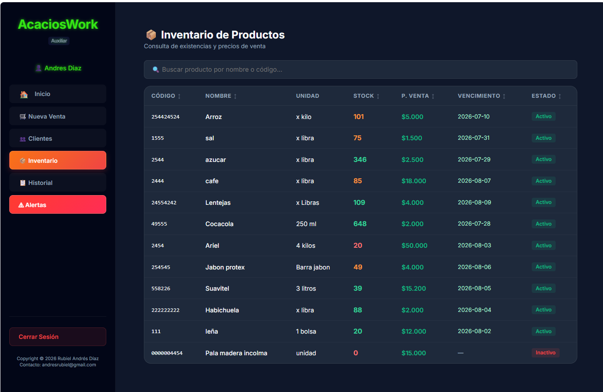

# 📖 Manual de Usuario - AcaciosWork (Auxiliar)
*Versión 1.0 — Registro de Ventas y Gestión de Clientes*

**Autor:** Rubiel Andrés Díaz  
**Contacto:** andresrubiel@gmail.com  
*Copyright © 2026 Rubiel Andrés Díaz*

¡Bienvenido al **Manual de Usuario de AcaciosWork para Auxiliares**! Este documento está diseñado para guiarte paso a paso en el uso diario de la plataforma. Como auxiliar, tus funciones principales son registrar ventas ágilmente, afiliar y buscar clientes, y consultar precios y existencias en el inventario.

---

## 📌 Tabla de Contenido
- [📝 Introducción](#-introducción)
- [🎯 Objetivos](#-objetivos)
- [💻 Requisitos del Sistema](#-requisitos-del-sistema)
- 1. [🔑 Acceso al Sistema (Inicio de Sesión)](#1-acceso-al-sistema-inicio-de-sesión)
- 2. [📊 El Panel de Control (Dashboard / Inicio)](#2-el-panel-de-control-dashboard-inicio)
- 3. [💳 Módulo de Ventas (Punto de Venta - POS)](#3-módulo-de-ventas-punto-de-venta-pos)
   - [Punto de Venta Vacío](#punto-de-venta-vacío)
   - [Búsqueda de Productos y Ajuste de Cantidades](#búsqueda-de-productos-y-ajuste-de-cantidades)
   - [Procesar Pago y Cierre de Venta](#procesar-pago-y-cierre-de-venta)
- 4. [👥 Gestión de Clientes](#4-gestión-de-clientes)
   - [Ver y Buscar Clientes](#ver-y-buscar-clientes)
   - [Agregar un Nuevo Cliente](#agregar-un-nuevo-cliente)
- 5. [📦 Consulta de Inventario de Productos](#5-consulta-de-inventario-de-productos)
- 6. [📋 Historial de Ventas del Día](#6-historial-de-ventas-del-día)
- 7. [⚠ Alertas de Stock y Vencimientos](#7-alertas-de-stock-y-vencimientos)
- 8. [🚪 Cerrar Sesión](#8-cerrar-sesión)
- [🏁 Conclusiones](#-conclusiones)

---

## 📝 Introducción
El rol del **Auxiliar** en **AcaciosWork** es fundamental para agilizar la facturación en caja y el servicio al cliente. La interfaz para el auxiliar ha sido diseñada de forma simplificada, limpia y rápida, permitiéndole operar las ventas diarias, la afiliación de clientes y la consulta de inventarios sin lidiar con opciones contables o administrativas complejas.

---

## 🎯 Objetivos
### Objetivo general
Orientar al personal auxiliar en la correcta utilización del sistema de información **AcaciosWork** para optimizar el registro de ventas y la gestión de la base de datos de clientes.

### Objetivos específicos
* Describir detalladamente el acceso seguro al sistema con credenciales de auxiliar.
* Explicar el funcionamiento del Punto de Venta (POS) para el cobro y facturación de artículos.
* Guiar en la consulta del catálogo de productos y verificación de stock actual.
* Detallar los procesos de búsqueda, ordenamiento dinámico y creación de clientes.
* Identificar las alertas críticas de stock y vencimiento de productos.

---

## 💻 Requisitos del Sistema
Para un desempeño óptimo y sin demoras en la caja registradora, el equipo del operador debe cumplir con:

### Hardware
* **Procesador**: Intel Core i3 o equivalente.
* **Memoria RAM**: 4 GB mínimo (se recomiendan 8 GB).
* **Pantalla**: Resolución mínima de 1280x720 píxeles.
* **Lector de Código de Barras**: Opcional, conectado vía USB o Bluetooth.

### Software
* **Navegador**: Google Chrome, Microsoft Edge, Mozilla Firefox o Apple Safari.
* **Red**: Conexión a internet o red local activa y estable.

---

## 1. 🔑 Acceso al Sistema (Inicio de Sesión)

Para ingresar al sistema:
1. Abre tu navegador web e ingresa a la URL provista para el sistema.
2. Introduce tu nombre de **Usuario** y tu **Contraseña**.
3. Haz clic en el botón naranja **Iniciar Sesión**.

*Figura 1: Formulario de acceso seguro para auxiliares de AcaciosWork.*

---

## 2. 📊 El Panel de Control (Dashboard / Inicio)

Al ingresar con tu cuenta de auxiliar, el sistema te redirigirá a la pantalla de **Inicio** o **Dashboard**. Esta pantalla te brinda un resumen rápido del estado operativo general de la tienda.

*Figura 2: Panel de inicio con contadores de productos y tabla interactiva de alertas de stock.*

Aquí podrás observar:
* **Tarjetas de Resumen**:
  * **Total Productos**: Total de artículos diferentes en el catálogo (Ej: 12).
  * **Próximos a Vencer**: Productos con caducidad cercana (Ej: 4).
  * **Stock Bajo**: Productos en cantidad crítica (Ej: 2).
* **Tabla de Alertas de Inventario**: Lista los productos con stock bajo o vencimiento próximo. Muestra una **barra de progreso de colores** para identificar visualmente la gravedad del stock:
  * **Rojo**: Stock crítico (menos del 30% del óptimo).
  * **Naranja**: Stock medio (del 30% al 69% del óptimo).
  * **Verde**: Stock suficiente y óptimo.
* **Buscador predictivo**: Permite filtrar rápidamente la tabla escribiendo en la casilla *"Buscar en la tabla..."*.

---

## 3. 💳 Módulo de Ventas (Punto de Venta - POS)

La pestaña **Nueva Venta** es el módulo central del cajero. Permite agregar artículos, calcular el IVA, los subtotales y totalizar el cobro del cliente al instante.

### Punto de Venta Vacío
Al ingresar al módulo, la pantalla se mostrará con el carrito vacío y el botón de registro deshabilitado.

*Figura 3: Interfaz limpia del Punto de Venta (POS) lista para operar.*

---

### Búsqueda de Productos y Ajuste de Cantidades
1. Haz clic en el buscador **BUSCAR PRODUCTO** y escribe el nombre del producto o lee su código de barras con el lector.
2. Haz clic sobre el artículo en la lista de sugerencias para agregarlo al carrito.
3. Modifica la cantidad de unidades en el campo **CANT.** de la tabla si el cliente lleva más de una unidad. Si necesitas retirar un artículo de la lista, presiona la **X roja** de la fila.
4. En el panel derecho **Resumen de Venta**, selecciona el cliente en la lista desplegable. Si no está registrado en la base de datos, presiona el botón verde **+ Nuevo Cliente** para crearlo rápidamente.

*Figura 4: Selección de artículos y asignación de cliente en el Punto de Venta.*

---

### Procesar Pago y Cierre de Venta
* Una vez revisado el total, haz clic en **Registrar Venta**.
* En el formulario emergente, indica el **Método de Pago** y escribe el **Monto Recibido**. El sistema calculará automáticamente el **Cambio** (vueltas) a entregar al cliente.
* Si el cliente decide aplazar momentáneamente su compra mientras busca otro artículo, puedes presionar **Guardar como Pendiente** para almacenar la venta en la sección de la parte inferior de la pantalla sin bloquear la caja.

---

## 4. 👥 Gestión de Clientes

En la pestaña **Clientes** puedes administrar los datos de contacto y afiliación de los clientes de la tienda.

### Ver y Buscar Clientes
Verás la base de datos con Nombre, Documento, Teléfono, Email y Estado, además de estadísticas de clientes registrados y activos.
* **Ordenamiento por Columnas**: Puedes hacer clic sobre las cabeceras **NOMBRE**, **DOCUMENTO**, **TELÉFONO**, **EMAIL** o **ESTADO** para ordenar la tabla alfabética o numéricamente, según prefieras.

*Figura 5: Lista de clientes registrados en el sistema con columnas ordenables.*

---

### Agregar un Nuevo Cliente
1. Haz clic en el botón verde **+ Nuevo Cliente**.
2. Completa los datos en la ventana emergente: Nombre completo, Número de Documento (NIT o Cédula), Teléfono, Email, Dirección, y selecciona si es un Cliente Frecuente y su Estado actual.
3. Presiona **Guardar**.

*Figura 6: Formulario modal para el registro rápido de nuevos clientes.*

---

## 5. 📦 Consulta de Inventario de Productos

Al hacer clic en la pestaña **Inventario**, accederás al listado completo de productos del catálogo de la tienda en modo de **solo lectura**.

*Figura 7: Vista de consulta de inventario con precios de venta y fechas de vencimiento.*

* Esta sección permite verificar el Código, Nombre, Unidad, Stock, Precio de Venta y Fecha de Vencimiento de los artículos para responder consultas de clientes.
* Puedes ordenar la tabla rápidamente haciendo clic sobre las cabeceras de las columnas.
* Al final de cada fila, dispones del botón azul **Ver Detalles** para abrir una ventana emergente con la ficha técnica completa del producto sin peligro de modificar sus campos accidentalmente.

---

## 6. 📋 Historial de Ventas del Día

En la pestaña **Historial** podrás llevar el control de tus propias transacciones finalizadas en el transcurso del día de hoy.

*Figura 8: Resumen y lista de transacciones facturadas por el auxiliar.*

Esta sección te muestra:
* **Total Ventas**: Cantidad de tickets generados por tu usuario en el día.
* **Total Recaudado**: Dinero total cobrado en caja (útil para arqueos y cierres de turno).
* **Tabla de registros**: Lista las ventas indicando su ID, fecha y hora exacta, nombre del cliente y el total facturado. Las columnas poseen ordenamiento interactivo para facilitar la auditoría.

---

## 7. ⚠ Alertas de Stock y Vencimientos

El sistema realiza escaneos automáticos de tus productos. Cuando un artículo está próximo a vencer o por debajo de su cantidad mínima de seguridad, el botón **Alertas** del panel lateral parpadeará en color rojo.

*Figura 9: Ventanas de alertas para productos vencidos/por vencer y existencias bajas.*

En esta sección verás dos listas independientes:
1. **Productos Próximos a Vencer o Vencidos**: Muestra la fecha límite y calcula los días restantes. Si ya caducó, se marcará en rojo indicando el tiempo transcurrido (Ej: *"Vencido hace 16 días"*).
2. **Productos con Stock Bajo**: Lista los artículos cuyas unidades actuales en tienda son menores al stock mínimo de seguridad predefinido por el administrador.

---

## 8. 🚪 Cerrar Sesión

Para proteger la información de la tienda y evitar que otros registren ventas bajo tu usuario, debes cerrar tu sesión al finalizar tu turno de trabajo o al retirarte de la caja.

* Haz clic en el botón rojo **Cerrar Sesión** ubicado en la esquina inferior izquierda de la barra de navegación lateral. El sistema destruirá las credenciales temporales y te redirigirá a la pantalla de Login.

*Figura 10: Botón de cierre de sesión segura en la barra lateral.*

---

## 🏁 Conclusiones
La plataforma de **AcaciosWork** optimiza significativamente las operaciones diarias del auxiliar:
* **Facturación Eficiente**: El carrito de ventas reactivo y el autocompletado reducen los tiempos de espera del cliente.
* **Seguridad de Operación**: La interfaz de solo lectura de productos y la separación de roles protegen la integridad de los datos financieros.
* **Organización Práctica**: La capacidad de ordenar dinámicamente las tablas de clientes, productos e historial permite consultas ágiles en momentos de alto flujo comercial.
* **Control de Calidad**: El sistema visual de alertas previene la venta accidental de productos vencidos o desabastecidos.

---

Copyright © 2026 Rubiel Andrés Díaz  
Contacto: andresrubiel@gmail.com
