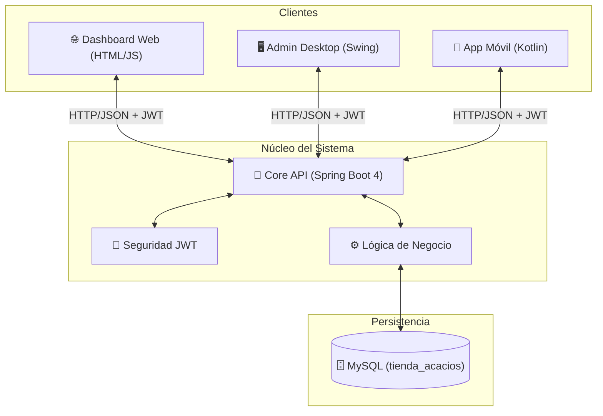
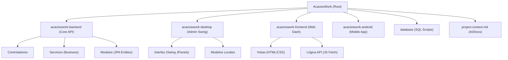
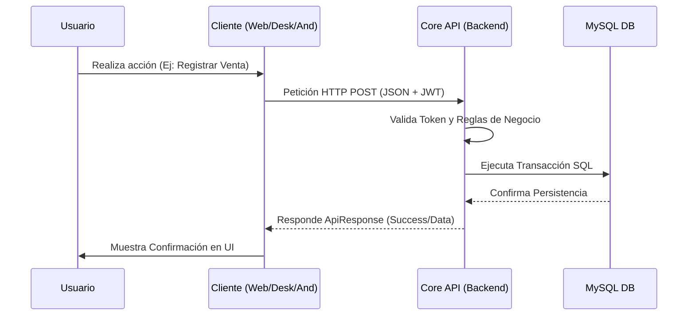
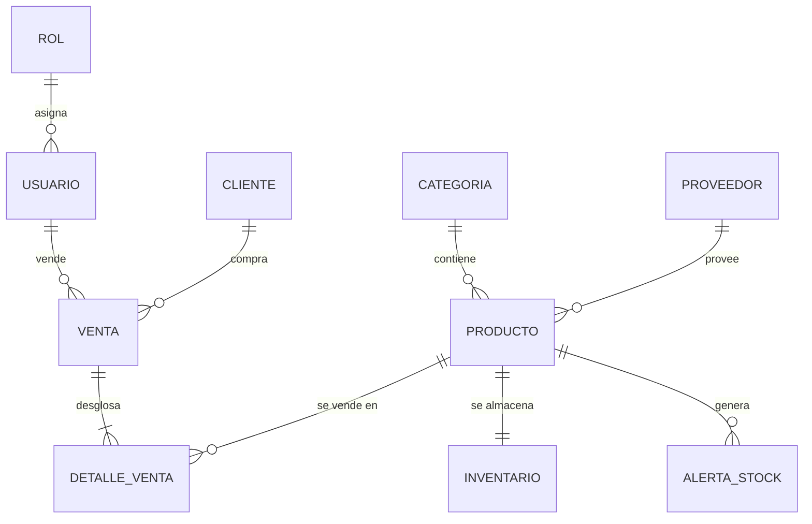
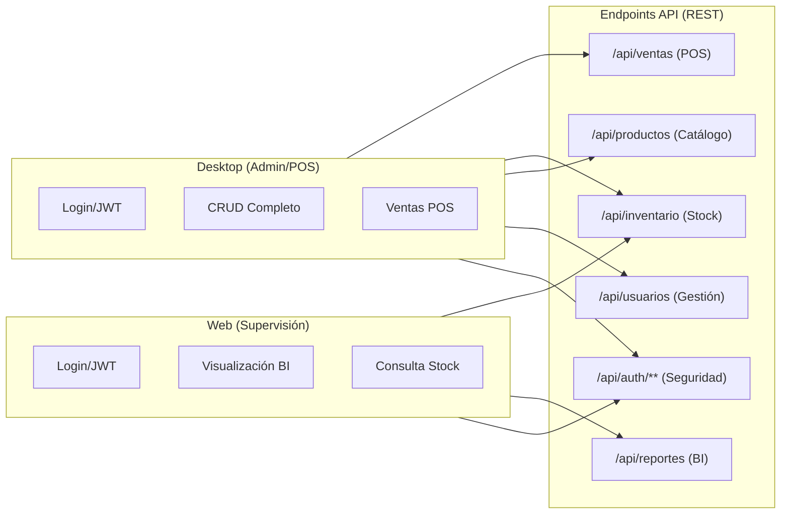

# ARCHIVO DE CONTEXTO: ACACIOSWORK
**INSTRUCCIÓN PARA DESARROLLADORES Y AGENTES INTELIGENTES**

> **ESTADO**: DESARROLLO ACTIVO - FASE DE ESTABILIZACIÓN Y ESCALADO
> **AUTOR PRINCIPAL**: RADJ - andresrubiel@hotmail.com
> **ÚLTIMA REVISIÓN**: 22 de Mayo, 2026

---

## 🌍 VISIÓN GENERAL DEL PROYECTO
AcaciosWork es un ecosistema de gestión empresarial (ERP/POS) multiplataforma diseñado bajo una arquitectura de **Backend Centralizado**. El sistema permite la administración de inventarios, ventas, usuarios y clientes desde aplicaciones de escritorio, web y móviles, garantizando que toda la lógica de negocio y los datos residan en un único punto de verdad.

---

## 📊 DIAGRAMAS DEL SISTEMA

### 1. Arquitectura General

### 2. Mapa Estructural (Project Structure)

### 3. Flujo de Datos (Data Flow)

### 4. Diagrama de Módulos (Lógica de Negocio)

```mermaid
graph LR
    subgraph Gestion_Core ["Gestión de Identidad"]
        USR[Usuarios & Roles]
        PROV[Proveedores]
        CLI[Clientes]
    end

    subgraph Logistica ["Logística e Inventario"]
        INV[Inventario]
        PROD[Productos]
        CAT[Categorías]
        ALERT[Alertas de Stock]
    end

    subgraph Operaciones ["Operaciones de Venta"]
        VENTA[Punto de Venta - POS]
        DEV[Devoluciones]
        CAJA[Cierre de Caja]
    end

    subgraph Inteligencia ["Inteligencia de Negocio"]
        REP[Reportes & Estadísticas]
        HIST[Historial de Accesos]
    end

    Gestion_Core --> Logistica
    Logistica --> Operaciones
    Operaciones --> Inteligencia
```

### 5. Diagrama de Base de Datos (ERD Simplificado)

### 6. API Map (Integraciones)

---

### 1. Núcleo API (`acacioswork-backend/`)
*   **Configuración (Seguridad/JWT/CORS)**: `src/main/java/com/acacioswork/config/`
*   **Endpoints (Controladores)**: `src/main/java/com/acacioswork/controller/`
*   **Lógica de Negocio (Servicios)**: `src/main/java/com/acacioswork/service/`
*   **Entidades de Datos (JPA)**: `src/main/java/com/acacioswork/model/`
*   **Acceso a Datos (Repositorios)**: `src/main/java/com/acacioswork/repository/`
*   **Recursos (Propiedades/Env)**: `src/main/resources/`

### 2. Cliente de Escritorio (`acacioswork-desktop/`)
*   **Pantallas y UI (Swing)**: `src/main/java/com/acacioswork/interfaz_usuario/`
*   **Conectividad API (Util)**: `src/main/java/com/acacioswork/util/`
*   **Modelos Locales**: `src/main/java/com/acacioswork/model/`

### 3. Cliente Web (`acacioswork-frontend/`)
*   **Vistas (HTML)**: Raíz del módulo (`login.html`, `dashboard.html`).
*   **Estilos (CSS)**: `css/styles.css`
*   **Lógica API (JS)**: `js/api.js`

### 4. Cliente Móvil (`acacioswork-android/`)
*   **UI/ViewModels/Network**: `app/src/main/java/com/acacioswork/`

### 5. Base de Datos (`database/`)
*   **Esquema Actualizado**: `database/02_tables.sql` (Lectura obligatoria para cambios en modelos).

---
## ESTÁNDAR DE DOCUMENTACIÓN Y COMENTARIOS
Todo bloque de código generado debe incluir: una descripción funcional breve y la firma del autor:

* Lenguaje Tecnología Formato Requerido
* **Java - Spring - JS / Kotlin** `/** Descripción breve. @author RADJ */`
* **CSS / MySQL** `/* Descripción breve. @author RADJ */`
* **HTML** `<!-- Descripción breve. @author RADJ -->`
* **JavaScript** `// Descripción breve. @author RADJ`

---

##  REGLAS TÉCNICAS OBLIGATORIAS (PROHIBICIÓN DE SALTOS)
1.  **AISLAMIENTO DE DATOS**: PROHIBIDO que clientes (Web, Desktop, Android) conecten directo a MySQL. Todo debe pasar por el Backend.
2.  **REGLA ID STANDARD**: Identificadores en MySQL: `BIGINT UNSIGNED`. En Java: `Long`.
3.  **ENTORNO**: Desarrollo mandatorio en **Java 25** y **Spring Boot 4.0.6**.
4.  **COMUNICACIÓN**: Exclusivamente vía **JSON/REST** con tokens **JWT** para autorización.

---

## 📈 ESTADO DEL AVANCE GLOBAL

### ✅ Finalizado (Producción Ready)
- **Seguridad**: Autenticación JWT en Backend y Clientes (Web, Desktop, Android).
- **Gestión Core**: CRUDs de Usuarios, Clientes, Proveedores y Categorías operativos en Backend, Desktop y Android.
- **Inventario**: Control de existencias avanzado con stock actual (`stockActual`), stock mínimo (`stockMinimo`), stock óptimo (`stockOptimo`) y unidad de medida (`unidadMedida`) en Backend, Desktop, Web y Android.
- **Ventas**: Módulo de `Venta` y `DetalleVenta` con persistencia atómica.
- **Android**: Aplicación móvil funcional en Kotlin / Jetpack Compose con pantallas de Login, Dashboard, Clientes, Inventario y Proveedores operativas.

### 🔄 En Proceso (Próximos Hitos)
- **Reportes**: Implementación de reportes visuales en Frontend y exportación a PDF/Excel. Estructura visual inicial en Desktop y Android.
- **Alertas**: Sistema de notificaciones para stock crítico.
- **Cierre de Caja**: Lógica contable para balance diario.

---

## 📝 REGISTRO DE CAMBIOS (LOG)
*   **2026-05-02**: Creación inicial del archivo de contexto y migración a `BIGINT`.
*   **2026-05-05**: Sincronización de CRUD de Usuarios entre Backend y Desktop.
*   **2026-05-12**: Estabilización de persistencia de Ventas y manejo de errores 409/400.
*   **2026-05-16**: **Estandarización de Documentación**: Se actualizaron todos los `README.md` del ecosistema para reflejar el stack tecnológico actual (Java 25, Spring Boot 4, FlatLaf, Kotlin 2).
*   **2026-05-16**: **Actualización de Contexto**: Reestructuración de este archivo para facilitar el mapeo de archivos a desarrolladores y agentes inteligentes.
*   **2026-05-22**: **Evolución del modelo de Producto y consolidación Android**:
    * Renombrado del campo `cantidad` a `stockActual` en base de datos, backend (Spring Boot), frontend (dashboard), desktop (Swing) y móvil (Android).
    * Adición de los campos `stockOptimo` y `unidadMedida` en el modelo de `Producto` en todos los componentes del sistema.
    * Actualización de los formularios y diálogos de creación/edición de productos (`ProductoDialog` en Desktop, `ProductoFormDialog` en Android y modal HTML en Frontend) para soportar los nuevos campos de stock y unidad de medida.
    * Migración y habilitación de la interfaz móvil (Kotlin/Compose) a estado operativo de desarrollo para las vistas de Login, Dashboard, Clientes, Inventario, Proveedores y estructura de Reportes.

---

## MAPEO RÁPIDO PARA DESARROLLADORES Y AGENTES INTELIGENTES
Si necesitas trabajar en un módulo específico, estos son los archivos clave:

| Tarea | Archivo/Ruta Principal |
| :--- | :--- |
| **Añadir un campo a la BD** | `database/02_tables.sql` -> `backend/.../model/` -> `desktop/.../model/` |
| **Modificar la Seguridad** | `backend/.../config/SecurityConfig.java` |
| **Cambiar el diseño Desktop** | `desktop/.../interfaz_usuario/Administrador.java` |
| **Arreglar peticiones API Web** | `frontend/js/api.js` |
| **Añadir lógica de negocio** | `backend/.../service/` (Siempre usar servicios, no lógica en controladores) |
